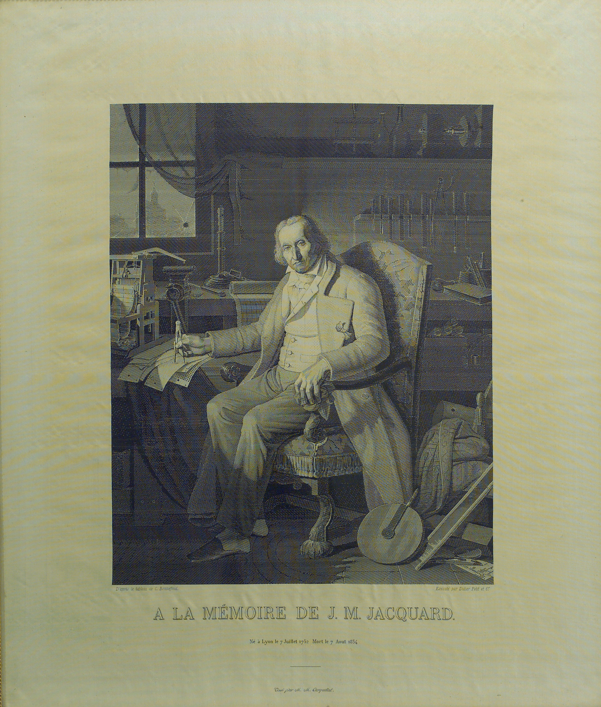
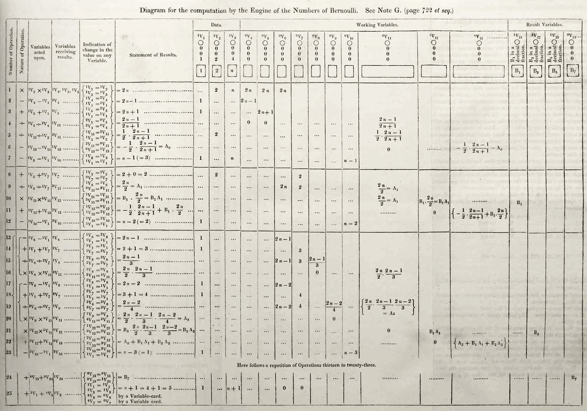
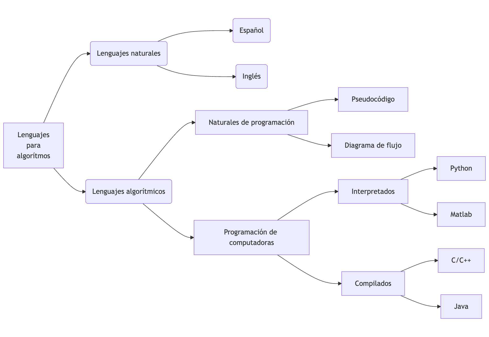
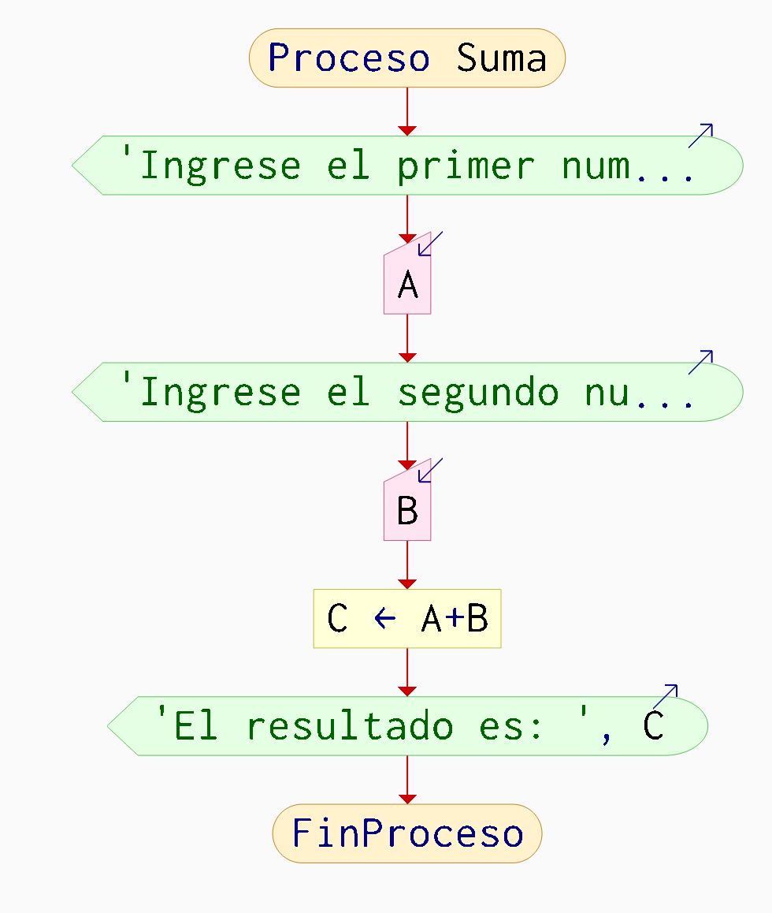
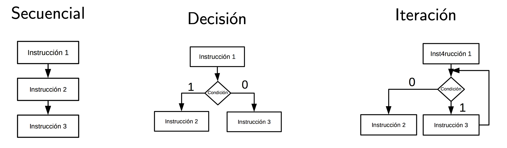
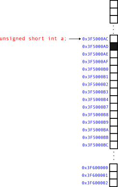
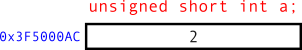

# Algoritmos y programación {.smaller}

Ing. Mecánica.  
Instituto Tecnológico de Querétaro   
Profesor: Dr. Rodrigo López Farías

## 1. Introducción a la computación {.smaller} 
1. Historia de los lenguajes de programación
2. Diagrama de flujo
3. Pseudocódigo
4. Estructura General de un programa
5. Variables y constantes 
6. Elementos Léxico y sintaxis
7. Lenguajes Interpretados y compilados
8. Entorno del lenguaje C, aplicaciones de última generación
9. Procesos de Edición, compilación y enlazado
10. Identificador, localidad de memoria y palabras reservadas

##
### 1.1 Historia de los lenguajes de programación 


Un programa es una secuencia de instrucciones organizadas para realizar una tarea que solucione un problema específico.

## {.smaller} 
### 1.1 Historia de los lenguajes de programación {.smaller} 

**Año 1801**  

Joseph-Marie Jaquard inventa el telar mecánico programada con tarjetas perforadas.  

En computación contribuyó en la codificación de instrucciones en tarjetas perforadas, que eran leídas por la máquina.

Las instrucciones tenían codificados patrones de tejido complejos en la tela. 


::: {layout="[8,-2,8]" layout-valign="top"}
](figuras/principio_telar){height=300px fig-align="center"}

{height=300px fig-align="center"}
:::


## {.smaller} 
### 1.1 Historia de los lenguajes de programación

**Año 1837**

Charles Babbage (1791-1871), fué un matemático e ingeniero mecánico que pionero en computación con el diseño de la primera computadora de propósito general llamada Máquina analítica. 

Tomó ideas del telar de Jaquard.  

La máquina nunca se construyó completamente.


::: {style="text-align:center;" .column width="50%"}
{height=300px fig-align="center"}
:::

::: {style="text-align:center;" .column width="50%"}
{height=300px fig-align="center"}
:::

## {.smaller} 
### 1.1 Historia de los lenguajes de programación

**Año 1850**lll

Ada Lovelace (1815-1852). Fué una matemática y escritora británica. Se le atribuye la generación del primer algoritmo.  
Según el estudio de su historia, es considerada como la primera ingeniera de software al estudiar la Máquina Analítica.
Aunque en la cultura popular se le atribuye la creación del primer algoritmo potencialmente programable, Charles Babbage escribió los primeros programas. 

::: {style="text-align:center;"}
{height=300px fig-align="center"}
:::

## {.smaller}
### 1.1 Historia de los lenguajes de programación


Algoritmo escrito por Ada Lovelace para calcular los números de Bernoulli.

::: {style="text-align:center;"}
{height=500px fig-align="center"}
:::

## {.smaller}
### 1.1 Historia de los lenguajes de programación

**Año 1936** 


El matemático Alan Turing (1912-1954) propone la Máquina de Turing teórica.  Es un modelo que computacional que formaliza un conjunto de algoritmos computables.

El modelo computacional realiza acciones de lectura o escritura según instrucciones automáticamente sobre una entrada llamada cinta, generando una salida en la misma cinta.

:::: {.columns}


::: {style="text-align:center;" .column width="50%"}


:::

::: {style="text-align:center;" .column width="50%"}

:::


::::

## {.smaller}
### 1.1 Historia de los lenguajes de programación
**Año 1950**. 

Nace el lenguaje ensamblador el cual por medio de abreviaturas Mnemotécnicas se indica las operaciones a realizar directamente en el microprocesador. Sigue siendo muy complicado programar. El lenguaje ensamblador tiene que ser traducidos a código binario por medio de un programa que se llama **Ensamblador**. 

Ejemplo:

::::{.columns}
:::{.column width="50%"}

```{.asm}
.model small   
.stack 100 h   
.data   
    num1 dw 5   ; Primer número   
    num2 dw 3   ; Segundo número   
    result dw ? ; Variable   de resultado
 .code   
main proc   
    mov ax, @data    ;Inicializar   
    mov ds, ax       ;segmento de datos
    mov ax, num1 ; Cargar num1 en AX   
    add ax, num2 ; Sumar num2 a AX   
    mov result , ax ; Almacenar el resultado  
    mov ax, 4 c00h ; Salir del programa   
    int  21 h   
main endp   
end mainx
```

:::

:::{.column width="50%"}
add ax, num2: Agrega el contenido de num2a ax.   

result dw ?: Declara una palabra no inicializada para almacenar el resultado.   
:::

::::


## {.smaller}
### 1.1 Historia de los lenguajes de programación
**Cronología de los lenguajes de programación mas influyentes y utilizados en la actualidad**

**Inicio de 1954**: FORTRAN (Fórmula Translator). Primer lenguaje de alto nivel creado por John Backus para aprovechar las capacidades de la IBM 704. Usado para análisis estructural. Se programaron métodos numéricos históricos.

<span style="color: red;">**1966** Teorema del lenguaje Estructurado.</span> 

**1969**: C. Creado por Kenneth Thompson y Dennis Ritchie.  Es un lenguaje de programación estructurada de propósito general de mediano nivel compilado. Es de los lenguajes mas portables y utilizados en el mundo. Se usa para programar microcontroladores, cálculo numérico intensivo, programación de sistemas embebidos.

**1980** C++. Bjarne Stroustrup amplía C con C++ enfocado a la programación orientada a objetos. Se usa para programar plataformas de software mas complejas. 

**1991**: Python. Es un lenguaje de alto nivel multi propósito interpretado, creado por Guido van Rossum. Es muy popular en actualidad (al año 2025). Utilizado ampliamente en inteligencia artificial. Es fácil de aprender y leer.


##
### 1.2 Lenguajes Interpretados vs Compilados


**Lenguajes interpretados:** 

* Se ejecutan por un interprete, que es un programa activo que lee y ejecuta directamente las instrucciones desde un código fuente en el espacio del usuario, como un archivo de texto, o un código intermedio llamado *Bytecode*. 

* Esto permite flexibilidad en la programación ya que si es 100% interpretado no es necesario recompilar el código cada vez que se hace una modificación.

* Si se genera *bytecode* compilado se guarda y se reutiliza para agilizar la ejecución después de hacer una modificación.


##
###  1.2 Lenguajes Interpretados vs Compilados


**Lenguajes Compilados:** 

* Requiren una traducción a lenguaje binaria que es entendible por la computadora antes de ejecutarse. 

* Son mas eficientes en tiempo de ejecución, pero se requiere mas esfuerzo para programar y validar. 

* Interacúan de manera mas cercana con el Hardware de la computadora. Se tiene un control mayor sobre la ejecuciónd el programa. 

* Son ejecutados directamente por el sistema operativo sin necesidad de un intérprete.

## {.smaller}
### 1.2 Clasificación de los lenguajes según su abstracción

{ width="800" style="display: block; margin: 0 auto" }

::: notes
flowchart LR
  A["Lenguajes 
  para
  algorítmos"] --> B[Lenguajes naturales]
  A--> C(Lenguajes algorítmicos)
  B(Lenguajes naturales)-->D1(Español)
  B(Lenguajes naturales)-->D2(Inglés)
  C -->E[Naturales de programación]
  E --> G1[Pseudocódigo]
  E --> G2[Diagrama de flujo]
  C -->F[Programación de computadoras]
  F -->H[Interpretados]
  F -->I[Compilados]
  H --> J1[Python]
  H --> J3[Matlab]
  I -->K[C/C++]
  I --> J2[Java]
::: 


## {.smaller}
### 1.3 Características principales de los lenguajes algorítmicos

* Diseñados para escribir prototipos de programas.

* Deben ser matemáticamente precisos.   

* Tienen una estructura general:  
    * Entrada. 
    * Cuerpo. 
    * Salida. 

* Contienen un conjunto básico de instrucciones. 
* Cuentan con **estructuras básicas de control** secuenciales y no secuenciales.


## {.smaller}
### 1.3.1 Lenguajes naturales de programación

**Diagrama de flujo:**  
Es una representación gráfica de de un algoritmo (o proceso).

::: {style="text-align:center;" width="50%"}


{width="400" }
:::


## {.smaller}
### 1.3.1 Lenguajes naturales de programación

**Pseudocódigo:**  
Es un lenguaje informal escrito en lenguaje natural que se aproxima a los lenguajes de programación de computadoras, para imitar en escencia la lógica de un programa, pero sin ser estricto en su léxico o sintáxis.

**Léxico:**
Conjunto de símbolos válidos en un lenguaje de programación.


**Sintáxis**
Son las reglas formales que especifican de manera rigurosa la organizacion de los símbolos contenidos en un lenguajes para formar expresiones, sentencias, y **programas válidos**.

::: {style="text-align:center;" width="50%"}

::: {style="text-align:center;" .column width="50%"}
Pseudocódigo
```{.asm}
Proceso
  Escribir 'Ingrese el primer numero:'
  Leer A
	Escribir 'Ingrese el segundo numero:'
  Leer B
	C <- A+B
	Escribir 'El resultado es: ', C
FinProceso
```
:::

:::


## {.smaller}
### 1.3.1 Teorema del programa estructurado propuesto por C Böhm y G. Jacopini (1966)

:::: {.columns}
:::{.column widht="50%"}
* "Un programa cumple el teorema de
estructura si y sólo si es propio y
está escrito usando al menos una de las tres
estructuras básicas de control".

* Es propio cuando: Tiene un solo
punto de entrada y un solo punto de
salida y entre dos puntos de control
del programa exista al menos un
camino.

:::
:::{.column widht="50%"}

* ¿Es propio este programa escrito en diagrama de flujo?
{width="400" }
:::

::::


## {.smaller}
### 1.3.1 Estructuras básicas de control.

::: {style="text-align:center;"}

:::

Cada caja, puede contener desde una instrucción hasta un bloque de instrucciones o función.
El rombo representa una condición que altera el flujo del programa al ser o no cumplida.
Aunque existen otras estructuras de control mas complejas, son derivadas
de estas tres.


## {.smaller}
### 1.3.1 Constantes, Variables y localidades en memoria.

Las **localidades** en memoria son espacios que almacenan un valor que se acceden usando un **identificador**.

Las variables y constantes están contenidas en las localidades de memoria.


**Variable**: Su valor es modificable durante la ejecución de un programa.

**Constante**: Su valor es fijo y no puede modificarse durante la ejecución de un programa.


:::: {.columns}
:::{.column widht="50%"}
::: {style="text-align:center;"}

:::

:::
:::{.column widht="50%"}

::: {style="text-align:center;"}

:::

:::

::::

## {.smaller}
### 1.3.1 Identificadores. 

Un identificador válido debe seguir las siguientes reglas: 


1. Consiste en solo letras dígitos y guiones bajos.
2. No debe comenzar con dígito.
3. Una palabra reservada no puede ser usada como identificador. 
4. Un identificador definido en la librería estandard de C no debe ser redefinido.

## {.smaller}
### 2.1 Tipos de datos fundamentales.


:::: {.columns}

:::{.column widht="50%"}
| tipo de enteros| Rango                   |
|----------------|----------------------------------|
| short          | [-32 768,32 767]                   |
| unsigned short | [0 - 65 535]                        |
| int            | [-32 768, 32 767]         |
| unsigned       | [0 - 4 294 967 295]                   |
| long           | [−2147 483 647 , 2 147 483 647] |
| unsigned long  | [0 ,  4 294 967 295]                    |
| char           |  algún caracter / valor [0,255]                  |
:::

:::{.column widht="50%"}
| Tipos de flotantes | Rango                   |
|----------------|----------------------------------|
| float          | $[10^{-37},10^{38}]$                   |
| double         | $[10^{-307},10^{308}]$                        |
| long double    | $[10^{-4931},10^{4932}]$      |
:::

::::

Rangos de valores de los diferentes tipos de datos en C C99 estándard. 


## {.smaller}
### 2.2 Construccion, evaluación de expresiones aritméticas y precedencia.


1. Todas las expresiones en paréntesis se evalúan separadamente. Expresiones con paréntesis anidados se evalúan de adentro hacia afuera.


2. Precedencia de operaciones.

* Se evalúan primero los que tienen mas alta prioridad. 

|  Operador              |       Prioridad            |
|----------------|----------------------------------|
|    paréntesis ()   | 0
|    Operadores unarios $+,-$ (-a)     | 1                   |
| $*,/,\%$ (módulo) |  2                       |
| operadores binarios $+,-$            | 3         |
| asignación    (x = 5)        | 4         |

3. Regla asociativa.

  * Si hay varios operadores unarios, se evalúan primero de derecha a izquierda.
  * Si hay varios operadores con la misma prioridad, se evalúan de izquierda a derecha
  * La asignación se resuelve de derecha a izquierda
  


:::{.notes}
Ejemplo: Cuál es el orden de la siguiente evaluación?
$$x * y * z + a / b - c * d$$
:::


## {.smaller}
### 2.2 Operadores relacionales, de igualdad y lógicos.

**Relacionales y de igualdad**

|  Símbolo              |       Nombre            |
|----------------|----------------------------------|
|  $<$     | Menor que                  |
|  $>$     | Mayor que                  |
|  $<=$     | Menor o igual que                  |
|  $>=$     | Mayor o igual que                  |
|  $==$     | Igual a                |
|  $!=$     | No igual a               |

Fe de erratas: 

Decía: El valor verdadero está dado por 1, o falso diferente por diferente a 1

Debe decir: El valor verdadero está dado por 1, o 0 para falso.

En lenguaje C, el valor entero 0 representa el valor falso y cualquier valor diferente a 0 es verdadero. 
**Operadores Lógicos**

## {.smaller}
### 2.2 Operadores relacionales, de igualdad y lógicos.

|  Nombre              |       Símbolo            |
|----------------|----------------------------------|
|  and/Y     | &&                |
|  or/O   | \|\|                  |
| not/negación  | !                  |


## {.smaller}
### Práctica de programación

```HTML{code-line-numbers="1,18|2-7|9,17|11|13|15"}
Algoritmo
    Notas-->
      Descripción breve del algoritmo
      Describir las entradas
      Describir las salidas
      Ejemplo de ejecución
    <--Notas

    -->Algoritmo principal
    
      Fase de Inicialización de variables (Define e inicializa variables)

      Fase de desarrollo (Captura datos, y procesa los datos)

      Fase de terminación (produce el resultado final) 

   <--Algoritmo principal
FinAlgoritmo
```

Los bloques de instrucciones contiguas se indican con una identación. 

## 3. Control de Flujo de programa {.smaller} 
1. Control Secuencial
2. Control Selectivo
3. Control repetitivo

## 3.1 Control Secuencial {.smaller} 
* Es una secuencia de instrucciones que se ejecutan por defecto linea por línea hasta que no se indique lo contrario.

Ejemplo de instrucciones

1. Definición de variables.
2. Lectura de valores
3. Escritura de cadenas de texto o valores de una variabl
4. Asignación de variables (=, <- en PseInt)
5. Ejecución de una expresión aritmética
6. Ejecución de una función (y = f(x))

## 3.1 Control Secuencial {.smaller} 
Ejemplo en PseInt

```
Algoritmo secuencia
	Definir x,z como Entero;
	Leer x;
	z = x*2;
	Imprimir z,"=x*2";
finAlgoritmo
```


## 3.1 Control Secuencial {.smaller} 
Ejercicios:

* Escriba un programa en Pseudocódigo que solicite al usuario 3 números diferentes enteros, y muestre su suma, su promedio, su producto.

* Escriba un programa en pseudocódigo que solicite al usuario 2 números enteros en variables a y b, e intercambie sus valores. Esto es, que el valor de b lo tenga a y viceversa.  


## 3.2 Control Selectivo **Si** 

El control selectivo 
```
Si <condición> Entonces  
  [Bloque de secuencia de instrucciones];
FinSi
```

Ejecuta el bloque de secuencia de instrucciones solo si la condición se cumple, si no la ejecución salta hasta la siguiente línea después del FinSi.

## 3.2 Control Selectivo **Si/Sino** 

El control selectivo 
```
Si <condición> Entonces  
  [Bloque de secuencia de instrucciones A];
SiNo
  [Bloque de secuencia de instrucciones B];
FinSi
```
Esta forma del sí representa una bifurcación en la ejecución del programa.

Si la condición se cumple entonces se ejecuta el Bloque de secuencia de instrucciones A, Si no se ejecuta el Bloque de secuencia de instrucciones B.

## 3.2 Control selectivo de casos.

```
\\Caso 1
Si <condición> Entonces  
  [Bloque de secuencia de instrucciones A];
FinSi

\\Caso 2
Si <condición> Entonces  
  [Bloque de secuencia de instrucciones B];
FinSi

\\Caso 3
Si <condición> Entonces  
  [Bloque de secuencia de instrucciones C];
FinSi

```
## 3.2 Control selectivo de casos Ejercicios. {.smaller}
**Instrucciones**. 

Leer 2 números: si son iguales que los multiplique, si el primero es mayor que el segundo que los reste y si no, que los sume.

Ordenamiento de 2 números.  
**Descripción:**  
Escribe un programa que pida al usuario 2 números enteros positivos y los muestre ordenados de menor a mayor.  

**Entradas:**  
- Dos enteros positivos.  

**Salidas:**  
- Los mismos dos números en orden ascendente.  

**Ejemplo:**  
- Entrada: `15, 8`  
- Salida: `8, 15`  


## 3.2 Control Selectivo Anidado(**Si/If**) {.smaller}

El control selectivo se puede anidar. 
```
Si <condicion1> Entonces  

    //Opción 1
    [Bloque de secuencia de instrucciones A];
SiNo

    Si <condición2> Entonces  
      //Opcion 2
      [Bloque de secuencia de instrucciones B];
    SiNo

        Si <condición3> Entonces  
            //Opción 3
            [Bloque de secuencia de instrucciones C];
        SiNo

            Si <condición4> Entonces  
                //opcion 4
                [Bloque de secuencia de instrucciones D];
            SiNo

              //Opcion 5
              [Bloque de secuencia de instrucciones E];
            FinSi
        FinSi
    FinSi
FinSi
```


## 3.2 Ejercicios {.smaller}

Tarea Para el 25 de Septiembre   **Instrucciones**.  

La jornada laboral estándar es de 40 horas por semana.
Si una persona trabaja más de ese límite, debe recibir remuneración extra: Hasta 40 h: se pagan a $5 por hora. De 41 a 50 h: las horas que excedan 40 se pagan al doble (=$10/h). Más de 50 h: además de lo anterior, las horas a partir de la 51 se pagan al cuádruple (=$20/h).

Escribe un programa que, dada la cantidad total de horas trabajadas en la semana, calcule el pago total y muestre un desglose con:

Horas pagadas a $5; Horas pagadas al doble;  Horas pagadas al cuádruple Y el pago total correspondiente.

Entrada

Un número entero no negativo que representa las horas trabajadas en la semana. Ejemplo ``53``.

Salida:

``Horas a $5: 40``

``Horas al doble: 10``

``Horas al cuádruple: 3``

``Pago total: $360``

Implementar la estructura de control Si anidada.


## 3.2 Ejercicios
Encontrar el menor de 3 números

**Descripción:**  
Pide al usuario 3 números enteros positivos diferentes, compara los valores por pares y muestra el menor.  

**Entradas:**  
- Tres enteros positivos distintos.  

**Salidas:**  
- El número menor.  

**Ejemplo:**  
- Entrada: `14, 9, 20`  
- Salida: `"El menor es 9"`  

## 3.2 Ejercicios
Ordenamiento de 3 números
**Descripción:**  
Tarea: Escribe un programa que pide al usuario 3 números enteros positivos, ordénalos en forma ascendente usando solo estructuras básicas `si/if` y comparando 1 par de valores por cada condición.  

**Entradas:**  
- Tres enteros positivos.  

**Salidas:**  
- Los tres números en orden ascendente.  

**Ejemplo:**  
- Entrada: `12, 4, 7`  
- Salida: `4, 7, 12`  


## 3.3 Estructura de control repetitivo (Mientras/ While)

Permite repetir un la ejecución de un bloque de instrucciones mientras una condición se cumple.

```
Mientras <condición>
    [Bloque de instrucciones]
FinMientras
```
Esta estructura puede anidarse.

```
Mientras <condición>
   
    Mientras <condición>
        [Bloque de instrucciones]
    FinMientras

FinMientras
```


## 3.3 Ejercicios con control repetitivo

**Tabla de multiplicar simple**

**Descripción:** Escribe un programa en pseudocódigo que solicite al usuario la tabla de multiplicar a imprimir del 1 al 10.

**Entradas:**  
2

**Salida**

```
2*1=2
2*2=4
.
.
.
2*10=20
```

## 3.3 Ejercicios con control repetitivo: valor centinela.{.smaller}

La varible centinela es un valor especial que indica el fin de la repetición de un ciclo.

**Cálculo de estadísticos de número variable de calificaciones**
Descripción: Escribe un programa en pseudocódigo que solicite al usuario un número variable de calificaciones de 0 al 10 y se detenga cuando el usuario intruduzca el un valor negativo. Al finalizar calcular el promedio de todos los valores introducidos.

Ejemplo programa en ejecución:
```


Introduce una calificación: 5
Introduce una calificación: 7
Introduce una calificación: 2
Introduce una calificación: -1


Haz introducido 3 calificaciones.
Su suma es 14.
Su promedio es 4.66
```
## 3.3 Ejercicios con control repetitivo: variable bandera.{.smaller}

La variable bandera es una variable que almacena información sobre el estado de un programa.

**Máximo común divisor**

En matemáticas, se denomina máximo común divisor o MCD al mayor número que divide exactamente a dos o más números a la vez. Como hablamos del mayor número solo tendremos en cuenta los divisores positivos. 
**Ejercicio:** Escribir un programa en pseudocódigo que pida al usuario 2 números enteros positivos y informe al usuario si tienen un MCD mayor a 1.

**Entradas**. 
Ingresa un número entero positivo: 5
Ingresa otro número entero positivo: 3.  
**Salidas**
El 5 y 3 no tienen maximo común divisor mayor a 1. 


**Entradas**. 
Ingresa un número entero positivo: 6.  
Ingresa otro número entero positivo: 3.  
**Salidas**. 
El 3 es el MCD del 6,y 3.   


## 3.3 Ejercicios con control repetitivo 

**Número primo**
Un número primo es un número entero mayor a 1 que solo es divisible entre 1 y el mismo.

**Descripción:**  
Escribe un programa que pida un número entero positivo y determine si es primo.


**Entradas:**  
- Número entero positivo.  

**Salidas:**  
- Mensaje: "Es primo" o "No es primo".  

**Ejemplo:**  
Verificando número primo.
- Entrada: `17`  
- Salida: `"17 es primo"` 


## 3.3 Ejercicios con control repetitivo {.smaller}

### Primos gemelos
Primos gemelos son pares de números primos cuya distancia es de 2 unidades. Por ejemplo, el par (3, 5) son primos gemelos porque son primos y su diferencia es 2. Otros ejemplos son (11, 13) o (41, 43). El número 5 es el único primo que puede pertenecer a dos pares de primos gemelos: (3, 5) y (5, 7). 


**Descripción:**  
Escribe un programa que pida un número entero positivo y determine si, este es primo, y si si, indicar si tiene número primo gemelo e imprimir el par de números primos gemelos.

**Entradas:**  
- Número entero positivo 2.  

**Salidas:**
Indicar, si es primo y si tiene un primo gemelo


**Salidas:**
11 es primo y el 13 es primo con distancia de dos unidades, por lo tanto son primos gemelos 

**Ejemplo:**  
Ingresa un número entero positivo mayor que 1.  
- Entrada: `13`  
- Salida: `"13 es primo y el 15 no es primo por lo que no son números primos positivos"` 


## 3.4 Reseña del Lenguaje C {.smaller}

- El **Lenguaje C** es un lenguje compilado desarrollado por **Dennis Ritchie** en los **Laboratorios Bell**.  
- **1972**: Se implementó por primera vez en una computadora **PDP-11**.  
- Se utilizó como lenguaje principal para el desarrollo del **sistema operativo UNIX**.  
- El objetivo de **C** es que sea **independiente del hardware** y **portable**,para que un mismo código pueda compilarse y ejecutarse en distintas plataformas y arquitecturas (Linux, Windows, Android, microprocesadores diversos).  
- Es un lenguaje modular. Cada módulo de software esta escrito en una **función**.
- C "estandard" se compone de dos partes: El lenguaje mismo con un conjunto de funciones y la Biblioteca Estandard que contiene otro conjunto de funciones opcionales. 


## 3.4 Estándares del Lenguaje C {.smaller}


- **1978**: **“C tradicional”** o **K&R C**, Presentado en *The C Programming Language* de Brian Kernighan y Dennis Ritchie.  

-[Posteriormente, aparecieron muchas variantes del lenguaje, generando la necesidad de unificar criterios.]  

- **1989**: Se publica el estándar **ANSI C** (también conocido como **C89**). Poco después, en 1990, la **ISO** lo adopta como **ISO C90**, la primera norma internacional del lenguaje.  

- **1999**: Aparece el estándar **C99**, que introduce varias mejoras como:  
  - Comentarios de una sola línea con `//`.  
  - Tipo lógico `_Bool` (y `<stdbool.h>`).  
  - Declaración de variables en cualquier punto del código.  
  - Nuevos tipos enteros fijos en `<stdint.h>`.  
  - Arreglos de longitud variable (VLAs).  


## 3.4 Estándares del Lenguaje C {.smaller}
- **2011**: Se publica el estándard **C11** (*ISO/IEC 9899:2011*).  Esta es la última versión con cambios importantes en funciones básicas.
  - Novedades:  
    - Se elimina la función `gets()`.  
  - Novedades avanzadas 
    - `_Static_assert` (aserciones en compilación).  
    - `_Generic` (selección genérica de tipos).  
    - `_Atomic` y `<stdatomic.h>`.  
    - `_Alignas`, `_Alignof` y `<stdalign.h>`.  
    - `_Noreturn`.  
    - `_Thread_local` y `<threads.h>` (opcional).  
    - Trigráfos eliminados.  

- **2017 / 2018**: Publicación de **C17** (*ISO/IEC 9899:2018*, también conocido como **C18**).  
  - Revisión menor del C11.  
  - Corrige defectos y ambigüedades sin añadir grandes cambios.  


## 3.4 Estándares del Lenguaje C {.smaller}

- **2023 / 2024**: Publicación de **C23** (*ISO/IEC 9899:2024*).  
  - Novedades destacadas en funciones avanzadas:  
    - Literal `nullptr` (como macro).  
    - Literales de cadenas Unicode `u8`, `u16`, `u32`.  
    - Mejoras en atributos y anotaciones (`[[...]]`).  
    - Ampliación de funciones estándar y macros.  
    - Mayor soporte para Unicode y portabilidad moderna.  

* El compilador C se encuentra en el paquete GNU Compiler collection (GCC).

* GCC tiene licencia GNU General Public License versión 3 (GPLv3). 

* Qué significa?: "Permite a los usuarios copiar, distribuir y modificar el software, siempre que se mantengan bajo los mismos términos de la licencia.""

Documentación a los estándares del lenguaje C en GCC. [(Link)](https://gcc.gnu.org/onlinedocs/gcc-15.2.0/gcc/Standards.html#C-Language)


## 3.4 Ejemplo de un programa en C

```{.c}
#include <stdio.h>
#define PI 3.1416
#define CUADRADO(x) ((x) * (x))

int main() {
    /*Este programa calcula el área de un círculo*/
    float r = 5.0;
    float area = PI * CUADRADO(r);

    /*Mostrar resultado*/
    printf("Área del círculo: %f\n", area);
    return 0;
}
```

## 3.5 Entorno del Lenguaje C

El entorno C consiste en los siguientes componentes que forman parte del procesamiento de un programa escrito en C, desde la edición hasta su ejecución.


## 3.5 Entorno del Lenguaje C {.smaller}

1. Editor (Escribir el programa en un editor de texto)
2. Preprocesador. Genera una versión del programa curada y expandido intermedio manejando unas instrucciones especiales llamadas **directivas** indicadas al inicio con # y borrando comentarios.


::::{.columns}
:::{.column width="50%"}
Código en C original.
```{.c}
#include <stdio.h>
#define PI 3.1416
#define CUADRADO(x) ((x) * (x))

int main() {
    float r = 5.0;
    float area = PI * CUADRADO(r);

    /* Mostrar resultado*/
    printf("Área del círculo: %f\n", area);
    return 0;
}
```
:::

:::{.column width="50%"}
Código C preprocesado
```{.c}
/* Inserta contenido de stdio.h aquí */
extern int printf(const char *format, ...);

int main() {
    float r = 5.0;
    float area = 3.1416 * ((r) * (r));

    printf("Área del círculo: %f\n", area);
    return 0;
}
```  
:::

::::


## 3.5 Entorno del Lenguaje C


3. Compilador. El programa intermedio se traduce a un código máquina (objeto)
4. Enlazador. Vinculación de funciones externas al código objeto y generación de un único ejecutable.
5. Cargador. El cargador del sistema operativo hace una copia del programa ejecutable en la memoria RAM y 
6. La CPU ejecuta cada una de las instrucciones 


## 3.6 Introducción a la programación en C {.smaller}

Programa en C escrito en un archivo Programa01.c.

```{.c code-line-numbers="1|2,4|3|1-5"}
/*Primer programa en C*/
#include<stdio.h>
main(){ /*<-Inicia programa */
  printf("Hola mundo! \n ");
}/*Finaliza programa*/

```

* Línea 1 es un comentario en C. 
* Línea 2 es la librería ```stdio.h```(standard input/output) que contiene la función ```printf```.
* Línea **3-5** Es la **función** principal que contiene al programa que está encerrado entre llaves { }.
* Línea 4 es la función ```printf``` que recibe una cadena de texto. Cada línea de instrucción que no es de control debe finalizar con ```;```.
* ```\n``` es una combinación de 2 caracteres llamada secuencia de escape que representa salto de línea. Esta no se imprime en la pantalla.
* ```\``` Se le llama caracter de escape.

## 3.6 Secuencia de escape comunes


|  Símbolo              |       Nombre            |
|----------------|----------------------------------|
|  ```\n```    | Salto de línea                  |
|  ```\t```     | Tabulador                  |
|  ```\r```     | Retorno al inicio de la línea actual                  |
|  ```\a```     | Alerta                  |
|  ```\\```     | Caracter ```\```                |
|  ```\*```     | Doble comilla               |


## 3.6 Configurando GCC en Windows.{.smaller}


1. Una opción es [Instalando Devcpp](https://sourceforge.net/projects/dev-cpp/files/Binaries/Dev-C%2B%2B%204.9.9.2/devcpp-4.9.9.2_setup.exe/download). Otra es instalando Minimal GNU for Windows [MINGW](https://platzi.com/blog/como-instalar-gcc-para-compilar-programas-en-c-desde-la-consola-en-windows/).

2. Una vez instalado ubicar el comando ```gcc```. Si se optó por instalarlo por medio de DevCPP, debería estar en ```C:\Program Files (x86)\Dev-Cpp\MinGW64\bin\gcc.exe```

3. Ir a Inicio, clic derecho en Equipo y luego en Propiedades. Despúes, haces clic en Configuración avanzada del sistema $\rightarrow$ Variables de entorno… En Windows 10, ir a Inicio $\rightarrow$ Sistema $\rightarrow$ Configuración avanzada del sistema $\rightarrow$ Variables de entorno…

## 3.6 Configurando GCC en Windows.{.smaller}

Propiedades del Sistema 

Hacer click en el botón "Variables de entorno".


## 3.6 Configurando GCC en Windows.{.smaller}


::::{.columns}
:::{.column width="50%"}
4. Editamos la variable PATH


:::

:::{.column width="50%"}
5. Agregamos ```;C:\Program Files (x86)\Dev-Cpp\MinGW64\bin\``` al final del valor de la variable ```Path```.


:::


::::


## 3.6 Compilando con línea de comandos en Windows.


```
C:\users\rodrigo\codigos>gcc
gcc: fatal error: no input files
compilation terminated.

```

Esto es una señal de que gcc si esta instalado.

## 3.6 Compilando con línea de comandos en Windows
Escribimos el programa de ejemplo en un editor de texto y lo guardamos como ```Programa01.c```.
Ahora compilamos el ```Programa01.c``` para generar el código objeto ejecutable ```programa.exe```

Ejemplo:

```
C:\users\rodrigo\codigos>gcc Programa01.c -o programa.exe
```

Y lo ejecutamos:

```
C:\users\rodrigo\codigos>programa.exe
Hola mundo! 

```

## 3.6 Ejemplo: Instalando GCC en Linux.

En Distribuciones derivadas de Debian (ubuntu, pop_os, Linux mint )

```
$sudo apt install gcc
```


## 3.6 Compilando con línea de comandos en Linux.

Primero probamos si tenemos la colección de compiladores GNU. Uno de los compiladores es el compilador de C en diversos estàndares.  

Para esto probamos abriendo símbolo de sistema en windows, o la terminal en Linux. Usamos la terminal de Linux.


```
rdglpz@pop-os:~/codigos_c$ gcc
gcc: fatal error: no input files
compilation terminated.

```

Esto es una señal que gcc si esta instalado.

## 3.6 Compilando con línea de comandos
Escribimos el programa de ejemplo en un editor de texto y lo guardamos como ```Programa01.c```.
Ahora compilamos el ```Programa01.c``` para generar el código objeto ejecutable ```programa.o```

Ejemplo:

```
$ gcc Programa01.c -o programa.o
```

Y lo ejecutamos:

```
rdglpz@pop-os:~/codigos_c$ ./programa.o 
Hola mundo! 

```

## 3.6 Declaraciones de variables. {.smaller}

Ejemplo declarando una variable tipo entero sin inicializar.

```{.c}
int a;

```

Ejemplo declarando una variable tipo entero inicializada.


```{.c}
int a=1;
```

Recordemos que tenemos otros tipos de dato como:   

:::: {.columns}

:::{.column width="50%"}
| tipo de enteros| Rango                   |
|----------------|----------------------------------|
| short          | [-32 768,32 767]                   |
| unsigned short | [0 - 65 535]                        |
| int            | [-32 768, 32 767]         |
| unsigned       | [0, 4 294 967 295]                   |
| long           | [−2147 483 647 , 2 147 483 647] |
:::

:::{.column width="50%"}
| tipo de enteros| Rango                   |
|----------------|----------------------------------|
| char           |  algún caracter / valor [0,255]                  |
| unsigned long  | [0 ,  4 294 967 295]                    |


| Tipos de flotantes | Rango                   |
|----------------|----------------------------------|
| float          | $[10^{-37},10^{38}]$                   |
| double         | $[10^{-307},10^{308}]$                        |
| long double    | $[10^{-4931},10^{4932}]$      |
:::

::::

## 3.6 Imprimiendo en pantalla con `printf()` {.smaller}

Para esto, la función ```printf``` está incluida en la libreria ```stdio.h``` la cual debemos de agregar al inicio del programa.

```{.c}
#include<stdio.h>
int main(){
    printf("Hola mundo");  
}

```
## 3.6 Imprimiendo en pantalla con `printf()` {.smaller}

Si queremos imprimir un valor entero, necesitamos construir una cadena con formato.

```{.c}
#include<stdio.h>
int main(){
    int calificacion = 10;
    printf("Calificacion: %d", calificacion);  
}
```

Línea 4: la función ```printf``` esta recibiendo dos argumentos: 1) una cadena de formato de texto y 2) una variable. Imprime una cadena de texto con formato donde ```%d``` es un marcador de posición que especifica el formato para enteros (placeholder). Este marcador debe coincidir con el tipo de dato para imprimir de manera correcta.

Existen otros marcadores para imprimir:

:::: {.columns}
:::{.column widht="50%"}
* Flotantes ```%f```
* Caracteres ```%c```
* Cadenas de caracteres ```%s```
:::

:::{.column widht="50%"}
* Apuntadores ```%p``` (Direcciones de memoria)
* Valor sin signo ```%u```
:::
::::

## 3.6 Leyendo desde la entrada estándar (teclado) con `scanf()` {.smaller}


La función `scanf()` lee desde el teclado el valor de la variable, y recibe mínimo 2 argumentos:   

  ```{.c}
  int numero;
  scanf("%d", &numero);   // Correcto
  scanf("%d", numero);    // Correcto (sin &)
  ```
Una cadena con formato `"%d"`, y la referencia (dirección) anteponiendo **`&`** (ampersand) a la variable entera `numero`. A esta manera de manipular los valores se le llama paso por referencia.


{fig-align="center" scale=0.1}


## 3.6 Leyendo e imprimiendo en pantalla. 

- En `scanf()`, los valores se pasan **por referencia**. Esto es que ```&a``` da la referencia (dirección) a memoria donde se almacenará el valor dado por el usuario asociada a la variable ```a```.

- En `printf()`, los valores se pasan **por valor** (no con `&`).


## 3.6 Leyendo e imprimiendo información {.smaller}


```{.c}
#include<stdio.h>
int main(){
    int calificacion;
    printf("Introduce una calificacion:");
    scanf("%d", &calificacion)
    printf("Calificacion: %d \n", calificacion);  
}

```

En este ejemplo, la función ```scanf```, tiene dos argumentos: la cadena de formato `"%d"` tipo entero, y el paso de valor por referencia de la variable ```calificación``` con un ```&``` por delante. 

El ampersand ```&``` como prefijo indica la dirección asociada al identificador de la variable ```calificacion``` donde guardará el dato en memoria. 

`printf` recibe la cadena de formato `"%d"`, donde pondrá el valor de la variable `calificacion`.

## 3.6 Estructura de Control selectivo Si {.smaller}
Primera forma del ```if```.
```{.c}
condicion = 1;
if(condicion){
  /*<Bloque de instrucciones A>;*/
}
```
Segunda forma del ```if```
```{.c}
condicion = 1;
if(condicion){
    /*<Bloque de instrucciones A>;*/
}else{
    /*<Bloque de instrucciones B>;*/
}
```

Tercera forma del ```if```
```{.c}
condicion = 1;
condicion2 = 0;
if(condicion){
    /*<Bloque de instrucciones A>;*/
}else if (condicion2){
    /*<Bloque de instrucciones B>;*/
}
```


## 3.6 Estructura de control repetitivo Mientras

```{.c}
int i = 0;
while (i<10){
  /* haz algo */
  i=i+1;
}
```


## Ejercicios {.smaller}


**Hola mundo:** Escribir un programa en (lenguaje) C, que escriba en pantalla "Hola mundo".


**Número primo en C:** Reescribir el algoritmo en PSEint a lenguaje C, que decide si un número entero positivo es primo y explica porque es primo.

Ejemplo:

Caso 1. Cuando el entero si es primo.
```
Entrada: 
Dame un numero entero positivo: 7
Salida: 
El número 7 es primo porque solo es divisible entre 1 y el mismo.
--Fin del programa--
```

Caso 2. Cuando el entero no es primo
```
Entrada: Dame un numero entero positivo: 10000
Salida: El número 10000 no es primo porque es divisible entre 2.
--Fin del programa--
```
## Ejercicios:


**Familiarización con la salida en pantalla 1**:   
Escribir un programa en C, que imprima en un renglón $n$ asteriscos proporcionados por el usuario.
Ejemplo:
```
Dame el número de asteriscos para imprimir en un renglón: 5
*****
--Fin del programa--
```

**Familiarización con la salida en pantalla 2**:   
Escribir un programa en C, que imprima una columna de $n$ asteriscos proporcionados por el usuario.
Ejemplo:
```
Dame el número de asteriscos para imprimir en un renglón: 5
*
*
*
*
*
--Fin del programa--
```


## Ejercicios: {.smaller}


**Rectángulo con asteriscos**:   
Escribir un programa en C, que imprima un rectángulo de asteriscos de dimensión $n \times m$ proporcionado por el usuario.
```
Este programa dibuja un rectángulo de tamaño n x m proporcionaod por el usuario.

Dame la altura del rectángulo: 5
Dame la altura del rectángulo: 2

*****
*****

--Fin del programa--
```

 


**Triángulo rectángulo con base = altura con asteriscos cargado a la izquerda.**:   
Escribir un programa en C, que imprima un triángulo rectángulo cargado a la izquierda de base $b$ y altura $h$ iguales proporcionados por el usuario.
Ejemplo:
```
Este programa dibuja un triángulo rectángulo con tamaño de la base igual a la altura. 
Dame la base del triangulo rectángulo: 3
*
**
***
--Fin del programa--
```

## Ejercicios {.smaller}

**Triángulo rectángulo con base = altura cargado a la derecha.**:   
Escribir un programa en C, que imprima un triángulo rectángulo cargado a la derecha de base $b$ y altura $h$ iguales proporcionados por el usuario.
Ejemplo:
```
Este programa dibuja un triángulo rectángulo con tamaño de la base igual a la altura. 
Dame la base del triangulo rectángulo: 4
   *
  **
 ***
****
--Fin del programa--
```


**Triángulo rectángulo invertido cargado a la derecha:**Escribir un programa en C, que imprima un triángulo rectángulo invertido de base $b$ y altura $h$ cargado a la derecha iguales proporcionados por el usuario.
Ejemplo:
```
Este programa dibuja un triángulo rectángulo con tamaño de la base igual a la altura. 
Dame la base del triangulo rectángulo: 3
***
**
*
--Fin del programa--
```

## Ejercicios {.smaller}


**Triángulo isosceles**: Escribir un programa en C, que imprima un triángulo isoceles con asteriscos según la altura que proporcione el usuario y la punta siempre tenga un asterisco. Cada renglón del triángulo tiene un número impar de asteriscos.
```
Este programa dibuja un triángulo isoceles con altura h proporcionaod por el usuario.

Dame la altura del rectángulo: 4

    *
   ***
  *****
 *******
--Fin del programa--
```

## Ejercicios: {.smaller}


**Rombo con asteriscos**: Escribir un programa en C, que imprima un rombo de asteriscos en un número impar de renglones.
```
Este programa dibuja un rombo en 2n+1 renglones proporcionados por el usuario.
Dame n: 2
El rombo se dibujara en 2*2+1 = 5 renglones.
  *
 ***
*****
 ***
  *
--Fin del programa--
```

## Ejercicios: {.smaller}


**Fibonacci:** Escriba un programa en C que imprima los primeros $n$ términos de la serie de Fibonacci proporcionada por el usuario.
```
Serie de Fibonacci.
Ingresa los n primeros términos de la serie de Fibonacci: 7
Los primeros 7 términos de la serie de fibonacci son: 0,1,1,2,3,5,8,13,21

```


**Factorial:** Escriba un programa en C que lea un número positivo mayor o igual a cero y que calcule su factorial.
$5!=5\times4\times3\times2\times1$. 

El $0!=1$ por definición.

Ejemplo: 
```
Este programa calcula el factorial n de un número entero positivo n > 0.
Ingrese un entero positivo n >= 0: 5
5!=120
```

## Ejercicios {.smaller}


**Constante $e$:** Escriba un programa en C que lea el número de términos para calcular una aproximación a la constante matemática $e$.

$$e = 1 + \frac{1}{1!}+\frac{1}{2!}+\frac{1}{3!} +\dots +\frac{1}{n!}$$
Ejemplo: 
```
Este programa aproxima con n términos la constante matemática e.
Ingrese un entero positivo n > 0: 4
e es aproximadamente 2.6666.
```

# 4. Funciones $$y = f(x)$$ 


## 4.1 Funciones{.smaller}

Los programas en C se construyen a partir de módulos llamados **funciones**. 

Tienen la siguiente estructura.  Ejemplo.


```{.c}

int f(int x){
    /*Esta función recibe un argumento tipo entero lo procesa y lo regresa*/
    return x*x;

}

```

```{.c}

void g(){
    /*Esta función no recibe ni regresa algún valor*/

    /*Las variables declaradas dentro de una función son llamadas variables locales*/
    int x = 1;
    printf("Esta funcion hace un proceso interno");

}

```


## 4.1 Ejemplo

Programa que calcula el cuadrado de un entero con una función.2
```{.c}

#include<stdio.h>

/*Prototipo de la función*/
int f(int);

/*Función principal*/
int main(){
    int x, y;
    printf("Dame un valor entero para calcular su cuadrado: ");
    scanf("%d", &x);
    y = f(x);
    printf("El cuadrado de %d es %d \n", x, y);
    return 0;
}

/*Definición de la funcion*/
int f(int x){
    /*Esta función recibe un argumento tipo entero lo procesa y lo regresa*/
    return x*x;


```


# 4.1 Funciones

- Las funciones permiten ser programadas una sola vez, y ser **reutilizadas** cualquier número de veces en el programa.
-Incrementan la organización y legibilidad del código.
- Podemos crear nuestras propias librerías de funciones.


# 4.1 Funciones de biblioteca estándard

## Cabeceras más usadas{.smaller}

| Cabecera | % Uso | Descripción |
|-----------|-------|--------------|
| `<stdio.h>` | 90 % | Entrada/salida estándar |
| `<string.h>` | 75 % | Manipulación de cadenas |
| `<math.h>` | 30 % | Funciones matemáticas |
| `<time.h>` | 20 % | Fecha y hora |
| `<stdlib.h>` | 80 % | Gestión de memoria, utilidades generales |
| `<stddef.h>` | 60 % | Tipos comunes (`size_t`, `ptrdiff_t`) |
| `<stdint.h>` | 50 % | Enteros de tamaño fijo |
| `<limits.h>` | 45 % | Límites de tipos enteros |
| `<ctype.h>` | 40 % | Clasificación/conversión de caracteres |
| `<errno.h>` | 25 % | Manejo de códigos de error |


---

## Cabeceras de uso frecuente{.smaller}

| Cabecera | % Uso | Descripción |
|-----------|-------|--------------|
| `<signal.h>` | 20 % | Manejo de señales |
| `<stdarg.h>` | 15 % | Argumentos variables |
| `<assert.h>` | 12 % | Aserciones de depuración |
| `<stdbool.h>` | 8 % | Tipo booleano (`true`/`false`) |
| `<inttypes.h>` | 5 % | Formatos para `intN_t` |
| `<tgmath.h>` | 5 % | Funciones matemáticas genéricas |
| `<wchar.h>` | 10 % | Cadenas de caracteres anchos |
| `<wctype.h>` | 8 % | Clasificación de caracteres anchos |
| `<locale.h>` | 2 % | Localización regional |
| `<iso646.h>` | 1 % | Operadores alternativos (`and`, `or`) |

---

## Cabeceras especializadas{.smaller}

| Cabecera | % Uso | Descripción |
|-----------|-------|--------------|
| `<complex.h>` | 3 % | Números complejos |
| `<fenv.h>` | 2 % | Entorno de coma flotante |
| `<setjmp.h>` | 1 % | Saltos no locales |
| `<uchar.h>` | 1 % | Soporte para `char16_t` y `char32_t` |
| `<errno.h>` | 25 % | Errores del sistema |
| `<signal.h>` | 20 % | Señales del sistema |
| `<stdarg.h>` | 15 % | Argumentos variables |
| `<assert.h>` | 12 % | Aserciones de depuración |

---

## Cabeceras modernas (C11–C23)

| Cabecera | % Uso | Descripción |
|-----------|-------|--------------|
| `<stdalign.h>` | 1 % | Alineación de tipos (C11) |
| `<stdatomic.h>` | 1 % | Operaciones atómicas (C11) |
| `<threads.h>` | 1 % | Hilos nativos (C11) |
| `<stdnoreturn.h>` | 1 % | Funciones sin retorno (C11) |
| `<stdbit.h>` | 1 % | Manipulación de bits (C23) |
| `<stdckdint.h>` | 1 % | Enteros con verificación de overflow (C23) |
| `<stdmchar.h>` | 1 % | Transcodificación multibyte (C23) |

---

## Notas finales

- Estos porcentajes son **estimaciones** basadas en análisis de código abierto y uso práctico.  
- Prioriza siempre la **portabilidad** usando `<stdint.h>` y `<inttypes.h>`.  
- Las cabeceras de C11/C23 requieren **compiladores modernos** (GCC ≥ 5, Clang ≥ 3.5).  
- Para proyectos nuevos, evita cabeceras obsoletas o dependientes de la implementación.

---

## Ejemplo funciones de librerías estandard{.smaller}

```{.c}
#include<stdio.h>
#include<stdlib.h>

int main(){
    int c, r;
    unsigned semilla = 1;
    
    while(semilla!=0){
    	printf("Dame un número semilla:");
    	scanf("%u", &semilla);
    	srand(semilla);
    	printf("Semilla %u genera tiradas:", semilla);
    	c = 0;

    	while(c<10){
    	    r = rand();
    	    r = r%6+1;
    	    printf("%u ", r);
    	    c=c+1;
    	}
    	printf("\n Teclea una semilla diferente de 0 para continuar \n");
    	scanf("%u", &semilla);   	
    }
```

##  Ejemplo funciones de librerías estandard {.smaller}

Generando números pseudoaleatorios utilizando el reloj de la computadora.

```{.c}
#include<stdio.h>
#include<stdlib.h>
#include<time.h>


int main(){
  
  /*tomamos los segundos del procesador desde Enero 1 de 1970*/
  unsigned int semilla = time(0);
  printf("Segundos desde Enero 1 de 1970: = %d \n", semilla);
  srand(semilla);
  printf("Numero entero pseudo aleatorio del 1 al 10: %d \n", rand()%10+1);
  return 0;
}
```


## Ejercicio {.smaller}

Juego simple con números aleatorios: Escribir un programa donde la computadora selecciones un entero al azar del 1 al 100 y el usuario intente adivinarlo con un número indefinido de oportunidades.

```
Adivina número.

Intenta adivinar que número tengo escondido, dame un número entre 1 al 10.: 5
El número es mayor

Intenta adivinar que número tengo escondido, dame un número entre 1 al 10.: 10
El número es menor

Intenta adivinar que número tengo escondido, dame un número entre 1 al 10.: 9
Haz encontrado el número con 3 intententos. 
Presiona cualquier tecla para continuar.


```


## 4.3 Declaración e invocación de funciones{.smaller}

```{.c}
#include<stdio.h>

/*Prototipo de la función*/
int f(int);

int main(){
    int x, y;
    printf("Dame un valor entero para calcular su cuadrado: ");
    scanf("%d", &x);
    y = f(x);
    printf("El cuadrado de %d es %d \n", x, y);
    return 0;
}

int f(int x){
    /*Esta función recibe un argumento tipo entero lo procesa y lo regresa*/
    return x*x;
}
```


# 5 Arreglos{.smaller}

Un arreglo es un grupo de de valores asociados con un índice que son del mismo tipo y tienen el mismo nombre. Se útilizan para representar vectores, matrices o tensores.

Un arreglo unidimensional se puede declarar de la siguiente manera: 

```{.c}
/*Arreglo de enteros tamaño 10 sin inicializar*/
int c[10]; 
```

Puede definirse también con constantes.

```{.c}
/*Arreglo sin inicializar de tamaño definido por una constante simbólica*/
#define T 10

/*Declaración del arreglo*/
int c[10]; 
```


```{.c}
/*Arreglo inicializado en 0 de tamaño definido por una constante simbólica*/
#define T 10

/*Declaración del arreglo*/
int c[10] = {0}; 
```

```{.c}
/*Arreglo inicializado de tamaño definido por una constante simbólica*/
#define T 10

/*Declaración del arreglo*/
int c[10] = {3,5,4,3,4,5,6,1,2,1}; 
```

# 5 Arreglos {.smaller}

| Posición | Valor |
|-----------|--------|
| c[0] | 17 |
| c[1] | 42 |
| c[2] | 8  |
| c[3] | 55 |
| c[4] | 23 |
| c[5] | 91 |
| c[6] | 34 |
| c[7] | 76 |
| c[8] | 12 |
| c[9] | 68 |


## 5 Arreglos {.smaller}

Inicializando e imprimiendo un arreglo de enteros tamaño 10.

```{.c}
#include<stdio.h>
#define T 10

int main(){

  int c[T] = {4,2,1,2,3,4,10,2,1,8};
  int i = 0;
  while(i<T){
  
        printf("%d \n", c[i]);
        i = i+1;
  }
  
  return 0;
}
```


## 5 Arreglos {.smaller}

Inicializando e imprimiendo un arreglo de enteros con ceros.

```{.c}
#include<stdio.h>
#define T 10

int main(){

  int c[T];
  int i = 0;
  while(i<T){
  
        c[i] = 0;
        printf("%d \n", c[i]);
        i = i+1;
  }
  
  return 0;
}
```

## 5 Arreglos {.smaller}

Inicializando e imprimiendo un arreglo con enteros aleatorios del 1 al 10

```{.c}
#include<stdio.h>
#include<stdlib.h>


#define T 10

int main(){

    unsigned int semilla = 1;
    int c[T];
    int i = 0; /*Es el indice*/
    int r = 0;
  
    while(i<T){

        r = rand()%10+1;  
        c[i] = r;
        i = i+1;
    }

    i = 0;
    while(i<T){
  
        printf("%s %d %s <- %d \n", "c[",i,"]", c[i]);
        c[i] = r;
        i = i+1;
    }
    return 0;
}
```
## Ejercicio: {.smaller}
Escribir en c una función ```void graficar(int a[],T)``` que genere una representación en grafica de barras con asteriscos de los valores de un arreglo de enteros de tamaño ```T```.


Por ejemplo: Si el arrego `a[5]={0,4,3,5,1}`, imprimir su representación en grafica de barras: 
```
ix
--
0:
1:****
2:***
3:*****
4:*


```

## 5 Algoritmos de ordenamiento. {.smaller}

Una de las aplicaciónes mas importantes en ciencias de la computación, es ordenamiento de datos. El algoritmo mas sencillo de todos es el **Algoritmo de la burbuja**.

```{.c}
#include<stdio.h>
#include<stdlib.h>
#define T 10 /*Constante simbllica, se recomienda que sea en mayusculas para distinguirlo en el programa*/


int main(){

    int a[T] = {1,9,2,4,5,3,45,5,6,3};
    int ix, jx, planchadas, aux;    
    
    printf("Arreglo antes de ordenar: ");
    
    ix = 0;
    while(ix<T){
        printf("%d ", a[ix]);
        ix = ix+1;
    }
    
    planchadas = 0;
    while(planchadas<=T-1){
        ix = 0;
        while(ix<=T-2){        
            if(a[ix]<a[ix+1]){
                aux = a[ix];
                a[ix] = a[ix+1];
                a[ix+1]=aux;
            }
            
            ix = ix+1;
        }
        planchadas = planchadas + 1;
    }
    
    printf("\n Arreglo despues de ordenar:");
    ix = 0;
        while(ix<T){
            printf("%d ", a[ix]);
            ix = ix+1;
        }
}
```
## 5 Algoritmos de ordenamiento. {.smaller}

Otro algoritmo de ordenamiento es el ordenamiento por insercion.


## 5 Ejercicio con arreglo unidimensional {.smaller}


Ejercicio:

Programar un histograma de frecuencias. Escribir un programa en C que genere N números aleatorios entre 1 y 10 solicitados por el usuario, y genere un histograma de frecuencias en consola.

Por ejemplo si 10 valores generados son a = [1,1,1,2,2,3,3,3,3,3]

1:***  
2:**   
3:****  
4:  
5:  
6:  
7:  
8:  
9:  
10:  


## Arreglo bidimensional{.smaller}

Ejercicio: 

1) Escribir un programa en C, que pida al usuario la dimension de una matriz de enteros la inicialice con valores aleatorios del 1 al 10 y  la imprima en consola.

2) Escribir un programa en C que pida al usuario las dimensiones de dos matrices, 

## Arreglo bidimensional{.smaller}

Ejercicio: Registro de temperaturas semanales

Se desea crear un programa en C que registre las temperaturas mínimas y máximas durante una semana (7 días). Para ello, se utilizará un arreglo bidimensional de 7 filas y 2 columnas, donde:

La columna 0 guarda la temperatura mínima del día.

La columna 1 guarda la temperatura máxima del día.

Requisitos del programa:

Pedir al usuario que ingrese las temperaturas mínimas y máximas de cada uno de los 7 días.

Mostrar todas las temperatu1ras registradas en formato de tabla.

Calcular y mostrar:

El promedio de temperaturas mínimas de la semana.

El promedio de temperaturas máximas de la semana.

Determinar y mostrar el día (número de 1 a 7) que tuvo la mayor diferencia entre temperatura máxima y mínima.

## Arreglo Bidimensional 

Ejercicio:
Escribir un programa en C que guarde en una matriz 3x3 enteros proporcionados por el usuario

Calcular la suma de la diagonal principal

Objetivo: Reforzar recorrido con índices [i][j], aplicar lógica simple


## Arreglos de caracteres {.smaller}

Características de los arreglos de caracteres.

* Se puede utilizar con una literal de cadena para su inicialización.
```{.c}
char s[] = "mecanica"; 
```

* su tama~no es del número de caracteres + un caracter nulo ``\0``.

Los arreglos de caracteres deben declararse lo suficientemente grande para contener las cadenas de caracteres.

## Leyendo e imprimendo una cadena de caracteres en consola{.smaller}

```{.c}

#include<stdio.h>

int main(){

	char string[20];
	scanf("%s", string);
	printf("%s", string);

}
```

## {.smaller}

```{.c}
#include<stdio.h>


int main(){a
    int i = 0;
	  char string[20];
	  scanf("%s", string);

	  printf("Imprimendo caracter por caracter hasta el fin de la cadena\n");
	  while(string[i]!='\0'){
		    printf("%c ", string[i]);
		    i = i + 1;
	  }
}
```

## Ejercicio. Qué hace el siguiente programa?

```{.c}
#include <stdio.h>
#include <stdlib.h>
#include <time.h>

int main() {
    int n;

    /* Semilla para generar números aleatorios diferentes cada vez*/
    srand(time(NULL));

    /* Pedir tamaño del arreglo*/
    printf("Ingrese el tamaño del arreglo: ");
    scanf("%d", &n);

    int i,j;
    int arreglo[n];
    int conteo[11] = {0}; // conteo[1] a conteo[10]

    /* Llenar el arreglo con números aleatorios entre 1 y 10*/
    printf("\nValores generados:\n");
    i = 0;
    
    while(i<n){
        arreglo[i] = rand() % 10 + 1; // número entre 1 y 10
        printf("%d ", arreglo[i]);
        conteo[arreglo[i]] = conteo[arreglo[i]] + 1;
        i=i+1;
    }

    return 0;
}
```

## Arreglos bidimensionales

En C se declaran como
```{.c}
/*M y N son dos números enteros positivos mayores que cero*/
int a[M][N];
```

## Ejercicio arreglo bidimensional

Escribir un programa en C que pida al usuario los valores de una matriz bidimensional M[3][3], tipo entero e imprima la matriz en consola.


## Apuntadores

Un puntero es una variable que almacena la dirección de memoria de otra variable.

Se usa para manipular datos indirectamente, pasar referencias a funciones, y acceder a memoria dinámica.

```{.c}
int x = 10;
int *p = &x;
```

```
+------+       +------+
|  p   | ----> |  x   |
|0x1000|       | 10   |
+------+       +------+

```


## Conceptos básicos

Ejemplo
```{.c}
#include <stdio.h>
#include <stdlib.h>

int main(void) {
    int x = 42;
    int *px = &x;

    printf("Valor de x: %d\n", x);
    printf("Direccion (&x): %p\n", (void*)&x);
    printf("px apunta a: %p\n", (void*)px);
    printf("Contenido *px: %d\n", *px);

    *px = 100;
    printf("Nuevo valor de x: %d\n", x);
    return 0;
}
```

## Aritmética de apuntadores 

```{.c}
#include <stdio.h>
#include <stdlib.h>

int main(void) {
    int a[5] = {10, 20, 30, 40, 50};
    int *p = a;         /* equivale a &a[0] */
    int i = 0;

    while (i < 5) {
        printf("a[%d] = %d\n", i, *(p + i));
        i = i + 1;
    }

    /* Otra forma: mover el apuntador (p) */
    p = a;
    i = 0;
    while (i < 5) {
        printf("via p: %d\n", *p);
        p = p + 1; /* avanzar al siguiente int */
        i = i + 1;
    }
    return 0;
}

```

## Paso por referencia

```{.c}
#include <stdio.h>
#include <stdlib.h>

void swap_int(int *a, int *b) {
    int tmp = *a;
    *a = *b;
    *b = tmp;
}

void acumular(int *dest, int valor) {
    *dest = *dest + valor;
}

int main(void) {
    int x = 3, y = 7, suma = 0;

    printf("Antes: x=%d, y=%d\n", x, y);
    swap_int(&x, &y);
    printf("Despues: x=%d, y=%d\n", x, y);

    acumular(&suma, 5);
    acumular(&suma, 8);
    printf("suma=%d\n", suma);

    return 0;
}

```
## Memoria Dinamica 


`void *malloc(int n);`: reserva un numero n de bytes de memoria sin inicialiar.

`void *calloc(size_t nmemb, size_t size);` reserva un numero de n bytes en memoria fisica pero inicializada en 0

`void *realloc(void *ptr, size_t size);` reasigna un numero de n bytes en memoria fisica pero inicializada en 0

## Ejemplos

Array de int dinámicamente de 100 posiciones:

```{.c}

int *v;

v =  (int *) malloc(100 * sizeof(int));
v = (int *) calloc(100, sizeof(int));

v = (int *) realloc(v, 150*sizeof(int));
```

- Redimensionar 'v' para que tenga 150 posiciones:

```{.c}

int *v;

v = (int *) realloc(v, 150*sizeof(int));
```

# Cadenas{.smaller}

* En C una cadena es un arreglo de caracteres que termina con `'\0'` Y un apuntador al inicio de la cadena. 

* Un caracter esta guardado en un byte (8 bits) en c99.

# Leer cadena con `fgets`{.smaller}

```{.c}
/*stdin es identificador predefinido incluido en stdio.h*/
fgets(s1, sizeof(s1), stdin);
```

s1: Es un arreglo de char donde se guardará el texto leído.

sizeof(s1): Indica el límite máximo de caracteres a leer.
fgets nunca leerá más de n - 1 caracteres → evita desbordes.

stdin: Es la entrada estándar, generalmente el teclado.

## Verificando el tamaño de una variable tipo char.

```{.c}
#include<stdio.h>
#include<stdlib.h>

int main(){
    /*Probando el tamano de char*/
    printf("El tamano de char es: %ld Byte \n",sizeof(char));
}
```
`El tamano de char es: 1 Byte `


* Sin embargo, el compilador decide la codificación. (En Linux, c99 es tipicamente UTF-8). 

* UTF-8  utiliza de 1 a 4 bytes. bytes para representar todos los simbolos. https://www.charset.org/utf-8
 
## Representacion de un valor entero como caracter.
El Estandard C garantiza solo ASCII básico (0–127).
```{.c}
#include<stdio.h>
#include<stdlib.h>
#include<math.h>

int main(){

    int i;

    
    i = 0;
    printf("asci = char\n");
    while(i<127){
        printf("%d = %c\n",i,i);
        i = i+1;
    }
    
 
   
}
```


## Sin embargo es posible representar caracteres UTF-8 codificado con 2 bytes

```{.c}
#include<stdio.h>

int main(){
    /*Imprimiendo caracter UTF-8 en 2 bytes*/
    printf("%c%c", 0xC3, 0x91);
}
```


## Declarando cadenas.


Ejemplo:
```{.c}
char color[] = "azul"
/*char colorP = "azul"*/
```

Es equivalente a:
```{.c}
char color[] = {'a','z','u','l','\0'}
```


## Operaciones básicas de cadenas con funciones en string.h 

* `size_t strlen(const char* str)`; — longitud

* `char *strcpy(char *dest, const char *src);` — copiar de *src a *dest

* `char *strcat(char *dest, const char *src);` — Concatena la cadena src al final de dest, y devuelve un puntero a dest.

* `char *strcat(char *dest, const char *src, size_t n);` — Concatena la cadena src al final de dest, y devuelve un puntero a dest con limite size_t n

##  
* `int strcmp(const char *s1, const char *s2);` — Compara lexicográficamente s1 y s2

* `char *strchr(const char *s, int c);` — busca carácter

* `char *strstr(const char *haystack, const char *needle);` — buscar subcadena (extra opcional)

* `size_t strcspn(const char *s, const char *reject);` -  longitud hasta encontrar un carácter prohibido. Ejemplo ``strcspn(s1, "\n")``

## Ejemplo Programa en C  implementando algunas operaciones básicas.

```{.c}
#include <stdio.h>
#include <string.h>

int main() {

    char s1[100];
    char s2[100];
    char copia[100];
    char concat[200];

    printf("Ingresa la primera cadena: ");
    fgets(s1, sizeof(s1), stdin);
    s1[strcspn(s1, "\n")] = '\0';   /* quitar salto de línea */

    printf("Ingresa la segunda cadena: ");
    fgets(s2, sizeof(s2), stdin);
    s2[strcspn(s2, "\n")] = '\0';   /* quitar salto de línea */

    printf("\n=== 7 OPERACIONES BÁSICAS SOBRE CADENAS EN C ===\n\n");

    /*
        strlen(cadena)
        Recibe: un arreglo de char terminado en '\0'
        Devuelve: tamaño de la cadena (sin contar '\0')
        %zu detecta el tipo correcto de dato a imprimir.
    */
    printf("1) strlen(s1) = %zu\n", strlen(s1));
    printf("   strlen(s2) = %zu\n\n", strlen(s2));

    /*
        strcpy(dest, src)
        Recibe: dos cadenas; copia totalmente src → dest
        Devuelve: un puntero a dest
    */
    strcpy(copia, s1);
    printf("2) strcpy(copia, s1) → copia = \"%s\"\n\n", copia);

    /*
        strncpy(dest, src, n)
        Recibe: dest, src y n
        Copia hasta n caracteres de src a dest
        Devuelve: un puntero a dest
        Nota: no garantiza '\0' → lo agregamos manualmente
    */
    strncpy(copia, s2, 4);
    copia[4] = '\0';
    printf("3) strncpy(copia, s2, 4) → copia = \"%s\"\n\n", copia);

    /*
        strcat(dest, src)
        Recibe: dest y src
        Concatena src al final de dest
        Devuelve: un puntero a dest
    */
    strcpy(concat, s1);
    strcat(concat, s2);
    printf("4) strcat(s1, s2) → \"%s\"\n\n", concat);

    /*
        strncat(dest, src, n)
        Recibe: dest, src y n
        Concatena n caracteres de src al final de dest
        Devuelve: un puntero a dest
    */
    strcpy(concat, s1);
    strncat(concat, s2, 3);
    printf("5) strncat(s1, s2, 3) → \"%s\"\n\n", concat);

    /*
        strcmp(s1, s2)
        Recibe: dos cadenas
        Devuelve:
            0   → cadenas iguales
            < 0 → s1 es "menor" que s2
            > 0 → s1 es "mayor" que s2
        Comparación lexicográfica según ASCII
    */
    printf("6) strcmp(s1, s2) = %d → ", strcmp(s1, s2));
    if (strcmp(s1, s2) == 0)
        printf("iguales\n\n");
    else if (strcmp(s1, s2) < 0)
        printf("s1 < s2\n\n");
    else
        printf("s1 > s2\n\n");

    /*
        strchr(cadena, c)
        Recibe: una cadena y un caracter
        Devuelve: puntero a la primera aparición de c, o NULL si no existe
    */
    char c;
    printf("Ingresa un caracter para buscar en s1: ");
    scanf(" %c", &c);

    char *p = strchr(s1, c);

    printf("7) strchr(s1, '%c') → ", c);
    if (p != NULL)
        printf("encontrado en la posición %ld\n\n", p - s1);
    else
        printf("no encontrado\n\n");

    /*
        EXTRA: strstr(cadena, subcadena)
        Recibe: una cadena y una subcadena
        Devuelve: puntero al inicio de la coincidencia, o NULL si no existe
    */
    char *q = strstr(s1, s2);
    printf("Extra) strstr(s1, s2) → ");
    if (q != NULL)
        printf("s2 aparece dentro de s1 desde pos %ld\n", q - s1);
    else
        printf("s2 NO está contenida en s1\n");

    return 0;
}
```


## Funciones de clasificacion de caracteres con ctype.h

Funcion,                Verdadero si

int isdigit(int c). c es digito

int isalpha(int c). si c es letra

int isalum(int c). si c es digito o letra

int isxdigit(int c). si c es hexadecimal

int islower(int c) si c es una letra minuscula

int isupper(int c) si c es una letra mayuscula

int tolower(int c). convierte una letra mayuscula a minuscula 

int toupper(int c). convierte una letra minuscula a mayuscula

int isspace(int c). Si es caracter de espacio en blanco ('\n', '\t')

int iscntrl(int c). Si es un valor de control

int ispunct(int c). verdadero si c es caracterr distinto a espacio un digito una letra 

int isprint(int c) Verdaderosi c c es un caracter de impresion incluyendo espacio ' ', 

int isgraph(int c). Verdaderosi c c es un caracter de impresion distinto a espacio '

## Cadena a numero con funciones en stdlib.h

| Función                           | Conversión           | Librería     |
| --------------------------------- | -------------------- | ------------ |
| `int atoi(const char *s);`        | string → `int`       | `<stdlib.h>` |
| `long atol(const char *s);`       | string → `long`      | `<stdlib.h>` |
| `long long atoll(const char *s);` | string → `long long` | `<stdlib.h>` |


## Numeros a cadena (stdio.h)
| Función                                                | Librería    | Descripción                                                          |
| ------------------------------------------------------ | ----------- | -------------------------------------------------------------------- |
| `sprintf(char *buf, const char  *fmt, ...);`            | `<stdio.h>` | Convierte datos numéricos a texto (sin límite → peligro de overflow) |
| `snprintf(char *buf, size_t n, const char *fmt, ...);` | `<stdio.h>` | Igual que `sprintf` pero segura                                      |

## Mayusculas a minusculas (ctype.h)
| Función               | Conversión            | Librería    |
| --------------------- | --------------------- | ----------- |
| `int toupper(int c);` | char → char mayúscula | `<ctype.h>` |
| `int tolower(int c);` | char → char minúscula | `<ctype.h>` |


## Comparacion y copia d cadenas (string.h)

| Función                 | Acción              | Librería     |
| ----------------------- | ------------------- | ------------ |
| `strcpy(dest, src)`     | Copiar cadena       | `<string.h>` |
| `strncpy(dest, src, n)` | Copia limitada      | `<string.h>` |
| `strcat(dest, src)`     | Concatenar          | `<string.h>` |
| `strncat(dest, src, n)` | Concatenar limitado | `<string.h>` |

## strtok(){.smaller}

`strtok()` — Función para dividir cadenas  
Se encuentra en `<string.h>`


`strtok()` **divide una cadena** en partes más pequeñas llamadas **tokens**, usando uno o varios **delimitadores**.

```c
char *strtok(char *cadena, const char *delimitadores);
```

##

Ejemplo:

```{.c}
#include<stdio.h>
#include<string.h>
int main(){
    char texto[] = "rojo,verde,azul";
    char *token = strtok(texto, ",");

    while (token != NULL) {
        printf("%s\n", token);
        /*strtok devuelve NULL cuando ya no quedan más tokens en la cadena.*/
        token = strtok(NULL, ",");
    }
}
```

## Ejercicios

Ejercicio 1: Contar vocales en una cadena. 
Escribe un programa que pida una frase y cuente cuántas vocales tiene. No usar funciones de biblioteca.
2

## 
Ejercicio 2: Verificar si una palabra es palíndromo

Leer una palabra sin espacios y determinar si es palíndromo.

Objetivos:

Usar strlen

Comparar izquierda–derecha

Concepto de índices convergente

##

Ejercicio 3 con string.h. 

Escribe un programa en C que analice un texto ingresado por el usuario y realice varias operaciones usando funciones de <string.h>, sin almacenar todas las palabras en un arreglo bidimensional.


1) Leer un texto completo del usuario (por ejemplo, hasta 500 caracteres) usando fgets.

2) Leer una palabra a buscar dentro del texto.

Contar cuántas veces aparece la palabra en el texto usando strstr:

Recorre el texto con un puntero.

Cada vez que strstr encuentre la palabra, suma 1 y avanza el puntero después de esa coincidencia.

Eliminar los signos de puntuación del texto:

Define una cadena con caracteres de puntuación, por ejemplo:
".,;:!?()\""

Recorre el texto carácter por carácter.

Si un carácter está en esa cadena (usando strchr), reemplázalo por espacio ' '.

Encontrar la palabra más larga del texto usando strtok y strlen, pero sin arreglo de palabras:

Usa strtok sobre el texto ya limpiado de puntuación, con delimitadores " \t".

Lleva dos cosas:

Un entero longitud_max.

Un arreglo char palabra_max[MAX_PALABRA] para guardar solo la palabra más larga encontrada hasta ahora.

Por cada token:

Calcula su longitud con strlen.

Si es mayor que longitud_max, actualiza longitud_max y copia esa palabra a palabra_max con strcpy.

Pedir dos palabras al usuario y compararlas con strcmp:

Lee palabra1 y palabra2 con fgets (eliminando el '\n' con strcspn).

Usa strcmp y muestra:

Si la primera es menor, mayor o igual a la segunda (lexicográficamente).

##


##
Ejercicio 4. 
Escribir un programa en C que lea un carácter del usuario y muestre qué tipo(s) de carácter es, usando las funciones de la biblioteca <ctype.h>

Ejercicio 5
Escribir un programa en C que convierta tres cadenas numéricas ingresadas por el usuario a tipos numéricos diferentes:

La primera a int con atoi()
La segunda a long con atol()
La tercera a long long con atoll()


## Unidad 8 Estructuras

Una estructura es una coleccion de diferentes tipos de datos.

Sintaxis

```{.c}
struct <structname> {
//...variables
};
```

Ejemplo

```{.c}
struct persona {
int edad;
char *nombre;
};
```


##

Declarar variables como tipo de la estructura añadiendolas despues de cerrrar la estructura pero antes del `;`.

```{.c}
struct persona {    
int edad;
char *nombre;
} pedro;
```

O varias varibles a la vez:

```{.c}
struct person {
int age;
char *name;
}pedro, personas[20];
```
##
Pueden declararse las estructuras despues.
```{.c}
struct persona {
int age;
char *name;
};
struct persona pedro;
```

Inicializando una estructura:
```{.c}
initialize a structure at declaration time:
struct person pedro = { 37, "Pedro" };
```
##
```{.c}
struct person {
int age;
char *name;
};
struct person flavio = { 37, "Flavio" };
/*puede usarse %d. pero %u es para imprimir un entero sin signo */
```
printf("%s, age %u", flavio.name, flavio.age);

Cambiar valores.

```{.c}
struct person {
int age;
char *name;
};
struct person flavio = { 37, "Flavio" };
flavio.age = 38;
```

## Declarando estructuras con typedef
```{.c}
struct carta {
    const char *cara;
    const char *palo;
};

typedef struct carta Carta;

int main() {
    Carta baraja[CARTAS];
}
```
# Apéndice 

## Apéndice {.smaller}
**Otros lenguajes importantes**

**1959**: COBOL. (Common Bussines Oriented Language): fué el primer lenguaje de programación portable.

**1964**: BASIC. Creado por los profesores John Kemeny y Thomas E. Kurtz. Era sencillo de aprender.

**1964**: LOGO. Lenguaje con propósitos educativos creado por Seymor Papert.

**1995**: JAVA. es un lenguaje de programación y una plataforma informática que fue comercializada por primera vez por Sun Microsystems. Tiene la característica que es compilado pero se ejecuta sobre una máquina virtual.


https://cgi.cse.unsw.edu.au/~learn/debugging/modules/gdb_watch_display/