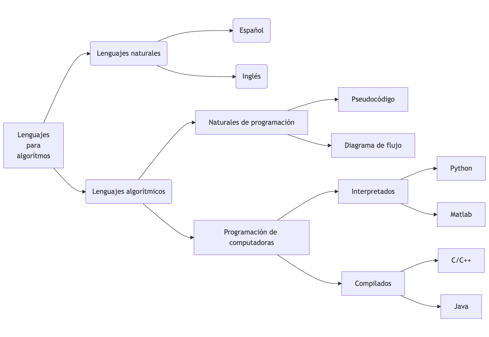
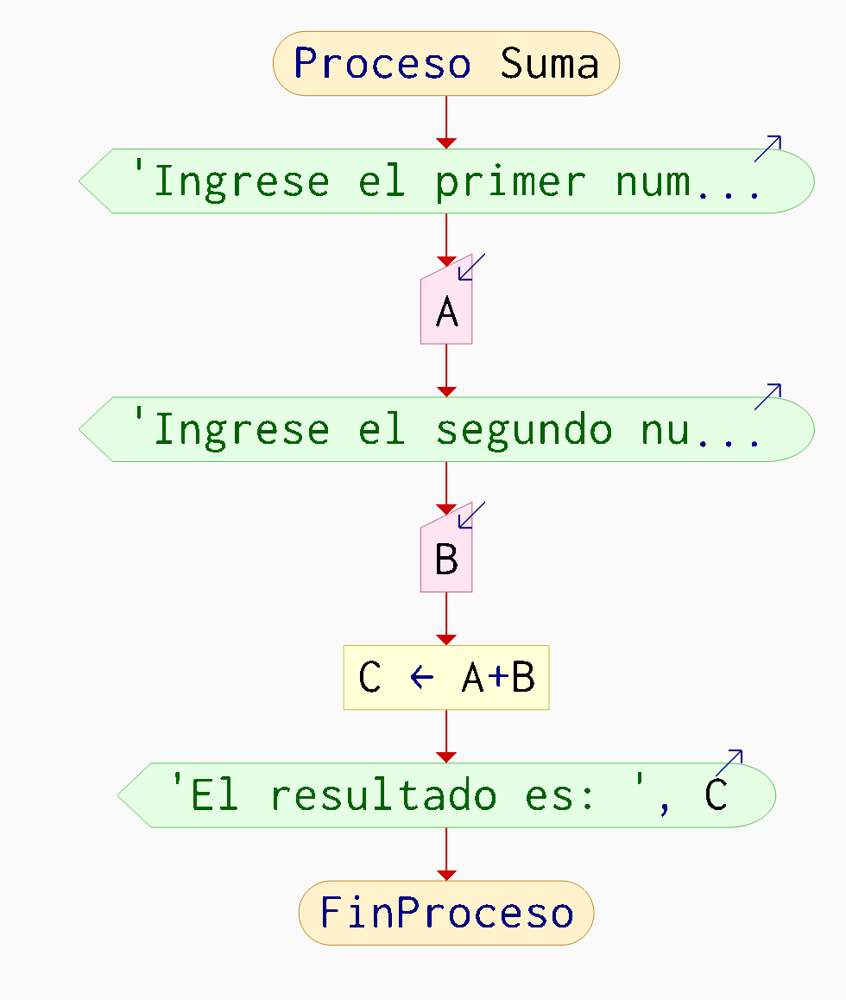
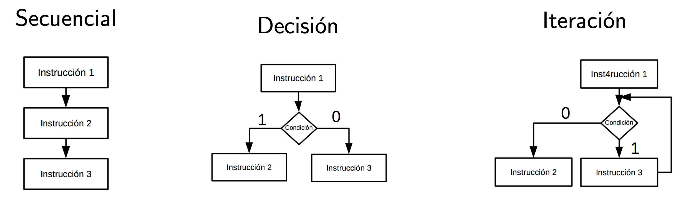

# Programación {.smaller}

Ing. Electrica.  
Instituto Tecnológico de Querétaro   
Profesor: Dr. Rodrigo López Farías

## 1. Fundamentos de Programacion {.smaller} 
1. Importancia de la programacion de computadoras
2. Clasificacion de los tipos de lengujes de programacion
3. Diseno de algoritmos
4. Diagramas de flujo (y pseudocodigo)
5. Uso de programas de simulacion para diagramas de flujo.
6. Compilación.

##
### 1.1 Importancia de la programacion de computadoras 

1. La programación es una herramienta para resolver problemas en casi todas las áreas de la ciencia.
2. Es un lenguaje técnico universal.
3. Permite crear otras herramientas y tecnología.
4. Es motor de la economía
5. La programación computacional es una habilidad mental adquirida por medio de un entrenamiento que sirve para resolver problemas complejos identificando subproblemas mas manejables. 
6. Incentiva el pensamiento lógico y estructurado y la creatividad para encontrar soluciones.


## {.smaller}
### 1.1.1 Historia breve de los lenguajes de programación
**Cronología de los lenguajes de programación mas influyentes y utilizados en la actualidad**

**Inicio de 1954**: FORTRAN (Fórmula Translator). Primer lenguaje de alto nivel creado por John Backus para aprovechar las capacidades de la IBM 704. Usado para análisis estructural. Se programaron métodos numéricos históricos.

<span style="color: red;">**1966** Teorema del lenguaje Estructurado.</span> 

**1969**: C. Creado por Kenneth Thompson y Dennis Ritchie.  Es un lenguaje de programación estructurada de propósito general de mediano nivel compilado. Es de los lenguajes mas portables y utilizados en el mundo. Se usa para programar microcontroladores, cálculo numérico intensivo, programación de sistemas embebidos.

**1980** C++. Bjarne Stroustrup amplía C con C++ enfocado a la programación orientada a objetos. Se usa para programar plataformas de software mas complejas. 

**1991**: Python. Es un lenguaje de alto nivel multi propósito interpretado, creado por Guido van Rossum. Es muy popular en actualidad (al año 2025). Utilizado ampliamente en inteligencia artificial. Es fácil de aprender y leer.


## {.smaller}
### 1.2 Clasificacion de los tipos de Lenguajes de programacion 

Lenguajes Interpretados vs Compilados


**Lenguajes interpretados:** 

* Se ejecutan por un interprete, que es un programa activo que lee y ejecuta directamente las instrucciones desde un código fuente en el espacio del usuario, como un archivo de texto, o un código intermedio llamado *Bytecode*. 

* Esto permite flexibilidad en la programación ya que si es 100% interpretado no es necesario recompilar el código cada vez que se hace una modificación.

* Si se genera *bytecode* compilado se guarda y se reutiliza para agilizar la ejecución después de hacer una modificación.


##
###  1.2 Lenguajes Interpretados vs Compilados


**Lenguajes Compilados:** 

* Requiren una traducción a lenguaje binaria que es entendible por la computadora antes de ejecutarse. 

* Son mas eficientes en tiempo de ejecución, pero se requiere mas esfuerzo para programar y validar. 

* Interacúan de manera mas cercana con el Hardware de la computadora. Se tiene un control mayor sobre la ejecuciónd el programa. 

* Son ejecutados directamente por el sistema operativo sin necesidad de un intérprete.

## {.smaller}
### 1.2 Clasificación de los lenguajes según su abstracción

{ width="800" style="display: block; margin: 0 auto" }

::: notes
flowchart LR
  A["Lenguajes 
  para
  algorítmos"] --> B[Lenguajes naturales]
  A--> C(Lenguajes algorítmicos)
  B(Lenguajes naturales)-->D1(Español)
  B(Lenguajes naturales)-->D2(Inglés)
  C -->E[Naturales de programación]
  E --> G1[Pseudocódigo]
  E --> G2[Diagrama de flujo]
  C -->F[Programación de computadoras]
  F -->H[Interpretados]
  F -->I[Compilados]
  H --> J1[Python]
  H --> J3[Matlab]
  I -->K[C/C++]
  I --> J2[Java]
::: 


## {.smaller}
### 1.3 Diseño de algoritmos

Pseudocódigo

* Los algoritmos deben ser matemáticamente precisos.   

* Tienen una estructura general:  
    * Entrada. 
    * Cuerpo. 
    * Salida. 

* Contienen un conjunto básico de instrucciones. 
* Cuentan con **estructuras básicas de control** secuenciales y no secuenciales.

* Existen dos enfoques en el diseno de algoritmos, Top Down (Partir un problema en problemas mas simples) o Bottom Up (Construir una solucion completa a partir de ir resolviendo "modulos" de problemas.).


## {.smaller}
### 1.4 Diagramas de flujo

**Diagrama de flujo:**  
Es una representación gráfica de de un algoritmo (o proceso).

::: {style="text-align:center;" width="50%"}


{width="400" }
:::


##

### 1.5 Compilador.

* Un compilador es un programa que traduce un programa en código fuente de algún lenguaje de programación de alto nivel escrito en un archivo de texto a un código de bajo nivel como lenguaje ensamblador, o directamente a código máquina que es un archivo binario ejecutable por el procesador (En Windows se identifica el archivo con el sufijo .exe, y en sistemas Unix son archivos ELF que no tienen tipicamente una extensión, pero se pueden identificar con los primeros bytes en hexadecimal).

```bash
$ file mi_programa
mi_programa: ELF 64-bit LSB executable, x86-64, ...
```

## 1.5 Compilador

* La colección de compiladores **GCC (GNU Compiler Collection)**, es uno de los mas utilizados en el mundo. Contiene compiladores para C , C++ , Objective-C, Objective-C++, Fortran , Ada, Go, D, Modula-2, COBOL, Rust y Algol 68.
[https://gcc.gnu.org/](https://gcc.gnu.org/)

* Es de **código libre** y está disponible para una gran variedad de arquitecturas de CPU (RISC (Snapdragon, Broadcom, Chip Apple), CISC (Intel core, AMD Ryzen), ), y sistemas operativos. Como GNU Linux, Windows UNIX, MAC OS.


## {.smaller}
### 1.4.1 Lenguajes naturales de programación

**Pseudocódigo:**  
Es un lenguaje informal escrito en lenguaje natural que se aproxima a los lenguajes de programación de computadoras, para imitar en escencia la lógica de un programa, pero sin ser estricto en su léxico o sintáxis.

**Léxico:**
Conjunto de símbolos válidos en un lenguaje de programación.


**Sintáxis**
Son las reglas formales que especifican de manera rigurosa la organizacion de los símbolos contenidos en un lenguajes para formar expresiones, sentencias, y **programas válidos**.

::: {style="text-align:center;" width="50%"}

::: {style="text-align:center;" .column width="50%"}
Pseudocódigo
```{.asm}
Proceso
  Escribir 'Ingrese el primer numero:'
  Leer A
	Escribir 'Ingrese el segundo numero:'
  Leer B
	C <- A+B
	Escribir 'El resultado es: ', C
FinProceso
```
:::

:::


## {.smaller}
### 1.4.2 Teorema del programa estructurado propuesto por C Böhm y G. Jacopini (1966)

:::: {.columns}
:::{.column widht="50%"}
* "Un programa cumple el teorema de
estructura si y sólo si es propio y
está escrito usando al menos una de las tres
estructuras básicas de control".

* Es propio cuando: Tiene un solo
punto de entrada y un solo punto de
salida y entre dos puntos de control
del programa exista al menos un
camino.

:::
:::{.column widht="50%"}

* ¿Es propio este programa escrito en diagrama de flujo?
{width="400" }
:::

::::


## {.smaller}
### 1.4.3 Estructuras básicas de control.

::: {style="text-align:center;"}

:::

Cada caja, puede contener desde una instrucción hasta un bloque de instrucciones o función.
El rombo representa una condición que altera el flujo del programa al ser o no cumplida.
Aunque existen otras estructuras de control mas complejas, son derivadas
de estas tres.


## {.smaller}
### 1.4.4 Constantes, Variables y localidades en memoria.

Las **localidades** en memoria son espacios que almacenan un valor que se acceden usando un **identificador**.

Las variables y constantes están contenidas en las localidades de memoria.


**Variable**: Su valor es modificable durante la ejecución de un programa.

**Constante**: Su valor es fijo y no puede modificarse durante la ejecución de un programa.


:::: {.columns}
:::{.column widht="50%"}
::: {style="text-align:center;"}

:::

:::
:::{.column widht="50%"}

::: {style="text-align:center;"}

:::

:::

::::
