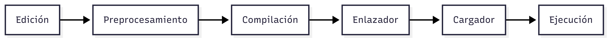
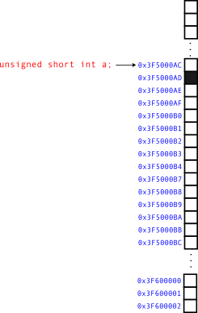
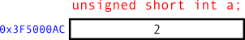

# Programación {.smaller}

Ing. Electrica.  
Instituto Tecnológico de Querétaro   
Profesor: Dr. Rodrigo López Farías

## 2. Elementos del lenguaje de programación 

1. Introducción al entorno de programación del lenguaje C.
2. Estructura básica de un programa
3. Comentarios, identificadores, palabras reservadas.
4. Variables y constantes
5. Operadores Aritméticos, lógicos, condicionales, de desplazamiento


## 2.1 Entorno de programación del lenguaje C

El entorno C consiste en los siguientes componentes que forman parte del procesamiento de un programa escrito en C, desde la edición hasta su ejecución.





## 2.1 Entorno del Lenguaje C {.smaller}

1. Editor (Se escribe el programa)
2. Preprocesador. Genera una versión del programa curado y expandido intermedio manejando unas instrucciones especiales llamadas **directivas** indicadas al inicio con # y borrando comentarios.


::::{.columns}
:::{.column width="50%"}
Código en C original.
```{.c}
#include <stdio.h>
#define PI 3.1416
#define CUADRADO(x) ((x) * (x))

int main() {
    float r = 5.0;
    float area = PI * CUADRADO(r);

    /* Mostrar resultado*/
    printf("Área del círculo: %f\n", area);
    return 0;
}
```
:::

:::{.column width="50%"}
Código C preprocesado
```{.c}
/* Inserta contenido de stdio.h aquí */
extern int printf(const char *format, ...);

int main() {
    float r = 5.0;
    float area = 3.1416 * ((r) * (r));

    printf("Área del círculo: %f\n", area);
    return 0;
}
```  
:::

::::


## 2.1 Entorno del Lenguaje C


3. Compilador. El programa intermedio se traduce a un código máquina (objeto)
4. Enlazador. Vinculación de funciones externas al código objeto y generación de un único ejecutable.
5. Cargador. El cargador del sistema operativo hace una copia del programa ejecutable en la memoria RAM y 
6. La CPU ejecuta cada una de las instrucciones 


## 2.2.1 Estructura Básica de un programa

1. Entrada

2. Cuerpo (Proceso). Incluye instrucciones

3. Salida

Ademas debe ser:

* Finito.

* Definido. 

* Efectivo


## 2.2.2 Elementos básicos de un programa

* Comentarios. Son anotaciones que se hacen en el código. Muchas veces para documentar lo que hace, pero también para desactivar instrucciones.

* Identificadores. Son aquellos nombres que identifican a las variables, constantes, nombre de funciones o clases en programación orientada a objetos.

*Las palabras reservadas son aquellas que no se pueden usar como identificadores, ya que son de uso exclusivo del lenguaje de programación.

* Estructuras de control.

* Operadores. Ejemplo: +,-, *, /

* Expresiones. Son las instrucciones del programa.


## {.smaller}
### 2.2.3 Constantes, Variables y localidades en memoria.

Las **localidades** en memoria son espacios que almacenan un valor que se acceden usando un **identificador**.

Las variables y constantes están contenidas en las localidades de memoria.


**Variable**: Su valor es modificable durante la ejecución de un programa.

**Constante**: Su valor es fijo y no puede modificarse durante la ejecución de un programa.


:::: {.columns}
:::{.column widht="50%"}
::: {style="text-align:center;"}

:::

:::
:::{.column widht="50%"}

::: {style="text-align:center;"}

:::

:::

::::

## {.smaller}
### 2.2.4 Identificadores. 

Un identificador válido debe seguir las siguientes reglas: 


1. Consiste en solo letras dígitos y guiones bajos.
2. No debe comenzar con dígito.
3. Una palabra reservada no puede ser usada como identificador. 
4. Un identificador definido en la librería estandard de C no debe ser redefinido.

## {.smaller}
### 2.2.5 Tipos de datos mas comunes utilizados en pseucodigo.

* Binarios
* Enteros con signo o sin signo
* Flotantes
* Caracter


## {.smaller}
### 2.2.5 Tipos de datos fundamentales en C.

:::: {.columns}

:::{.column widht="50%"}
| tipo de enteros| Rango                   |
|----------------|----------------------------------|
| short          | [-32 768,32 767]                   |
| unsigned short | [0 - 65 535]                        |
| int            | [-32 768, 32 767]         |
| unsigned       | [0 - 4 294 967 295]                   |
| long           | [−2147 483 647 , 2 147 483 647] |
| unsigned long  | [0 ,  4 294 967 295]                    |
| char           |  algún caracter / valor [0,255]                  |
:::

:::{.column widht="50%"}
| Tipos de flotantes | Rango                   |
|----------------|----------------------------------|
| float          | $[10^{-37},10^{38}]$                   |
| double         | $[10^{-307},10^{308}]$                        |
| long double    | $[10^{-4931},10^{4932}]$      |
:::

::::

Rangos de valores de los diferentes tipos de datos en C C99 estándard. 


## {.smaller}
### 2.2.6 Construccion, evaluación de expresiones aritméticas y precedencia.


1. Todas las expresiones en paréntesis se evalúan separadamente. Expresiones con paréntesis anidados se evalúan de adentro hacia afuera.


2. Precedencia de operaciones.

* Se evalúan primero los que tienen mas alta prioridad. 

| Prioridad | Operador                     | Ejemplo   |
|-----------|------------------------------|-----------|
| 1 (mayor) | Paréntesis `()`              | `(a + b)` |
| 2         | Operadores unarios `+`, `-`  | `-a`      |
| 3         | Multiplicación `*`, `/`, `%` | `a * b`   |
| 4         | Suma y resta `+`, `-`        | `a + b`   |
| 5 (menor) | Asignación `=`               | `x = 5`   |


## 
3. Regla asociativa.

  * Si hay varios operadores unarios, se evalúan primero de derecha a izquierda.
  * Si hay varios operadores con la misma prioridad, se evalúan de izquierda a derecha

4. La asignación se resuelve de derecha a izquierda ($x \leftarrow 5$) se lee "el valor 5 es asignado a x" .
  


:::{.notes}
Ejemplo: Cuál es el orden de la siguiente evaluación?
$$x * y * z + a / b - c * d$$
:::


## {.smaller}
### 2.2.7 Operadores relacionales y de igualdad

**Relacionales y de igualdad**

|  Símbolo              |       Nombre            |
|----------------|----------------------------------|
|  $<$     | Menor que                  |
|  $>$     | Mayor que                  |
|  $<=$     | Menor o igual que                  |
|  $>=$     | Mayor o igual que                  |
|  $==$     | Igual a                |
|  $!=$ , (PSEINT$<>$)     | No igual a               |


En lenguaje C, el valor entero 0 representa el valor falso y cualquier valor diferente a 0 es verdadero. 
**Operadores Lógicos**

## {.smaller}
### 2.2.7 Operadores lógicos.

| Operador | Significado | Ejemplo            |
|----------|-------------|--------------------|
| `&&`     | AND (y)     | `a > 0 && b > 0`   |
| `||`     | OR (o)      | `a > 0 || b > 0`   |
| `!`      | NOT (no)    | `!a`               |


### **Operador condicional ternario**

| Operador | Sintaxis                            | Ejemplo                   |
|----------|-------------------------------------|---------------------------|
| `?:`     | `condición ? valor_true : valor_false` | `x = (a > b) ? a : b;` |


