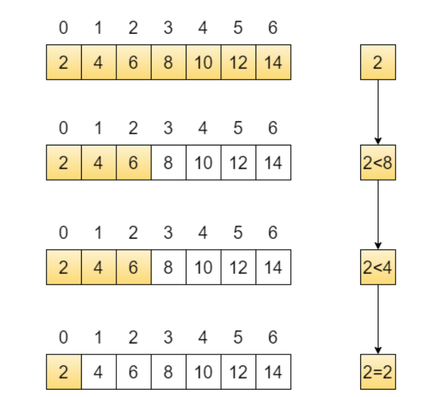

# 4 Arreglos{.smaller}

Un arreglo es un grupo de de valores asociados con un índice que son del mismo tipo y tienen el mismo nombre. Se útilizan para representar vectores, matrices o tensores.

Un arreglo unidimensional se puede declarar de la siguiente manera: 

```{.c}
/*Arreglo de enteros tamaño 10 sin inicializar*/
int c[10]; 
```

Puede definirse también con constantes.

```{.c}
/*Arreglo sin inicializar de tamaño definido por una constante simbólica*/
#define T 10

/*Declaración del arreglo*/
int c[10]; 
```


```{.c}
/*Arreglo inicializado en 0 de tamaño definido por una constante simbólica*/
#define T 10

/*Declaración del arreglo*/
int c[10] = {0}; 
```

```{.c}
/*Arreglo inicializado de tamaño definido por una constante simbólica*/
#define T 10

/*Declaración del arreglo*/
int c[10] = {3,5,4,3,4,5,6,1,2,1}; 
```

# 4 Arreglos {.smaller}

| Posición | Valor |
|-----------|--------|
| c[0] | 17 |
| c[1] | 42 |
| c[2] | 8  |
| c[3] | 55 |
| c[4] | 23 |
| c[5] | 91 |
| c[6] | 34 |
| c[7] | 76 |
| c[8] | 12 |
| c[9] | 68 |


## 4 Arreglos {.smaller}

Inicializando e imprimiendo un arreglo de enteros tamaño 10.

```{.c}
#include<stdio.h>
#define T 10

int main(){

  int c[T] = {4,2,1,2,3,4,10,2,1,8};
  int i = 0;
  while(i<T){
  
        printf("%d \n", c[i]);
        i = i+1;
  }
  
  return 0;
}
```


## 4 Arreglos {.smaller}

Inicializando e imprimiendo un arreglo de enteros con ceros.

```{.c}
#include<stdio.h>
#define T 10

int main(){

  int c[T];
  int i = 0;
  while(i<T){
  
        c[i] = 0;
        printf("%d \n", c[i]);
        i = i+1;
  }
  
  return 0;
}
```

## 4 Arreglos {.smaller}

Inicializando e imprimiendo un arreglo con enteros aleatorios del 1 al 10

```{.c}
#include<stdio.h>
#include<stdlib.h>


#define T 10

int main(){

    unsigned int semilla = 1;
    int c[T];
    int i = 0; /*Es el indice*/
    int r = 0;
  
    while(i<T){

        r = rand()%10+1;  
        c[i] = r;
        i = i+1;
    }

    i = 0;
    while(i<T){
  
        printf("%s %d %s <- %d \n", "c[",i,"]", c[i]);
        c[i] = r;
        i = i+1;
    }
    return 0;
}
```
## Ejercicio: {.smaller}
Escribir un programa en C que genere una representación en grafica de barras con asteriscos de los valores de un arreglo de enteros de tamaño ```T```.


Por ejemplo: Si el arrego `a[5]={0,4,3,5,1}`, imprimir su representación en grafica de barras: 
```
ix
--
0:
1:****
2:***
3:*****
4:*


```

## 4 Algoritmos de ordenamiento. {.smaller}

Una de las aplicaciónes mas importantes en ciencias de la computación, es ordenamiento de datos. El algoritmo mas sencillo de todos es el **Algoritmo de la burbuja**.

```{.c}
#include<stdio.h>
#include<stdlib.h>
#define T 10 /*Constante simbllica, se recomienda que sea en mayusculas para distinguirlo en el programa*/


int main(){

    int a[T] = {1,9,2,4,5,3,45,5,6,3};
    int ix, jx, planchadas, aux;    
    
    printf("Arreglo antes de ordenar: ");
    
    ix = 0;
    while(ix<T){
        printf("%d ", a[ix]);
        ix = ix+1;
    }
    
    planchadas = 0;
    while(planchadas<=T-1){
        ix = 0;
        while(ix<=T-2){        
            if(a[ix]<a[ix+1]){
                aux = a[ix];
                a[ix] = a[ix+1];
                a[ix+1]=aux;
            }
            
            ix = ix+1;
        }
        planchadas = planchadas + 1;
    }
    
    printf("\n Arreglo despues de ordenar:");
    ix = 0;
        while(ix<T){
            printf("%d ", a[ix]);
            ix = ix+1;
        }
}
```

## 4 Algoritmos de ordenamiento. {.smaller}

Que hace el siguiente algoritmo?

```{.c}

#include <stdio.h>

int main() {
    /*Ordena de manera ascendente */
    /*arreglo desordenado de enteros*/
    int arr[] = {5, 3, 8, 1, 4};

    /*especificar manualmente el tamaño del arreglo*/
    int n = 5;  
    int i, j, aux;

    i = 1;
    while (i < n) {

        aux = arr[i];
        j = i - 1;

        while (j >= 0 && arr[j] > aux) {
            arr[j + 1] = arr[j]; 
            j = j - 1;
        }

        arr[j + 1] = aux;
        i = i + 1;
    }

    i = 0;
    while (i < n) {
        printf("%d ", arr[i]);
        i = i + 1;
    }
    printf("\n");

    return 0;
}

```


## 4 Algoritmos de ordenamiento. {.smaller}

Ordenamiento por inserción.

```{.c}

#include <stdio.h>

int main() {
    /*Ordena de manera ascendente */
    /*arreglo desordenado de enteros*/
    int arr[] = {5, 3, 8, 1, 4};

    /*especificar manualmente el tamaño del arreglo*/
    int n = 5;

    /*i,j son indices que recorren el arreglo*/
    /* aux tendra la copia de un valor del arreglo a acomodar*/
    int i, j, aux;

    /*se asume que el lugar i=0 ya esta ordenado*/
    /*por eso i recorre de 1 a n-1*/ 
    i = 1;
    while (i < n) {

        aux = arr[i];
        j = i - 1;

        /*Recorre el arreglo mientras j>=0 y aux no este ordenado (arr[j] > aux*/
        while (j >= 0 && arr[j] > aux) {

            arr[j + 1] = arr[j]; /*intercambiar a la derecha arr[j] en arr[j+1] */
            j = j - 1;
        }

        arr[j + 1] = aux;
        i = i + 1;
    }

    /* imprimir resultado */
    i = 0;
    while (i < n) {
        printf("%d ", arr[i]);
        i = i + 1;
    }
    printf("\n");

    return 0;
}

```


## Busqueda binaria.

Cuando los arreglos estan ordenados, se requieren algoritmos eficientes para buscar valores.

Un algoritmo eficiente es la **Búsqueda Binaria**




## Tarea: programar la criba de Eratostenes en consola para la búsqueda de números primos.


## Arreglos bidimensionales

En C se declaran como
```{.c}
/*M y N son dos números enteros positivos mayores que cero*/
int a[M][N];
```

## Arreglo bidimensional{.smaller}

Ejercicio: 

1) Escribir un programa en C, que pida al usuario la dimension de una matriz de enteros la inicialice con valores aleatorios del 1 al 10 y  la imprima en consola.

2) Escribir un programa en C que pida al usuario las dimensiones de dos matrices, 

## Arreglo bidimensional{.smaller}

## 4 Ejercicio con arreglo unidimensional {.smaller}


Ejercicio:

Programar un histograma de frecuencias. Escribir un programa en C que genere N números aleatorios entre 1 y 10 solicitados por el usuario, y genere un histograma de frecuencias en consola.

Por ejemplo si 10 valores generados son a = [1,1,1,2,2,3,3,3,3,3]

1:***  
2:**   
3:****  
4:  
5:  
6:  
7:  
8:  
9:  
10:  


Ejercicio: Registro de temperaturas semanales

Se desea crear un programa en C que registre las temperaturas mínimas y máximas durante una semana (7 días). Para ello, se utilizará un arreglo bidimensional de 7 filas y 2 columnas, donde:

La columna 0 guarda la temperatura mínima del día.

La columna 1 guarda la temperatura máxima del día.

Requisitos del programa:

Pedir al usuario que ingrese las temperaturas mínimas y máximas de cada uno de los 7 días.

Mostrar todas las temperatu1ras registradas en formato de tabla.

Calcular y mostrar:

El promedio de temperaturas mínimas de la semana.

El promedio de temperaturas máximas de la semana.

Determinar y mostrar el día (número de 1 a 7) que tuvo la mayor diferencia entre temperatura máxima y mínima.

## Arreglo Bidimensional 

Ejercicio:
Escribir un programa en C que guarde en una matriz 3x3 enteros proporcionados por el usuario

Calcular la suma de la diagonal principal

Objetivo: Reforzar recorrido con índices [i][j], aplicar lógica simple


## Arreglos de caracteres {.smaller}

Características de los arreglos de caracteres.

* Se puede utilizar con una literal de cadena para su inicialización.
```{.c}
char s[] = "mecanica"; 
```

* su tama~no es del número de caracteres + un caracter nulo ``\0``.

Los arreglos de caracteres deben declararse lo suficientemente grande para contener las cadenas de caracteres.


## Ejercicio. Qué hace el siguiente programa?

```{.c}
#include <stdio.h>
#include <stdlib.h>
#include <time.h>

int main() {
    int n;

    /* Semilla para generar números aleatorios diferentes cada vez*/
    srand(time(NULL));

    /* Pedir tamaño del arreglo*/
    printf("Ingrese el tamaño del arreglo: ");
    scanf("%d", &n);

    int i,j;
    int arreglo[n];
    int conteo[11] = {0}; // conteo[1] a conteo[10]

    /* Llenar el arreglo con números aleatorios entre 1 y 10*/
    printf("\nValores generados:\n");
    i = 0;
    
    while(i<n){
        arreglo[i] = rand() % 10 + 1; // número entre 1 y 10
        printf("%d ", arreglo[i]);
        conteo[arreglo[i]] = conteo[arreglo[i]] + 1;
        i=i+1;
    }

    return 0;
}
```


## Ejercicio arreglo bidimensional

Escribir un programa en C que pida al usuario los valores de una matriz bidimensional M[3][3], tipo entero e imprima la matriz en consola.


## Leyendo e imprimendo una cadena de caracteres en consola{.smaller}

```{.c}

#include<stdio.h>

int main(){

	char string[20];
	scanf("%s", string);
	printf("%s", string);

}
```

## {.smaller}

```{.c}
#include<stdio.h>


int main(){a
    int i = 0;
	  char string[20];
	  scanf("%s", string);

	  printf("Imprimendo caracter por caracter hasta el fin de la cadena\n");
	  while(string[i]!='\0'){
		    printf("%c ", string[i]);
		    i = i + 1;
	  }
}
```